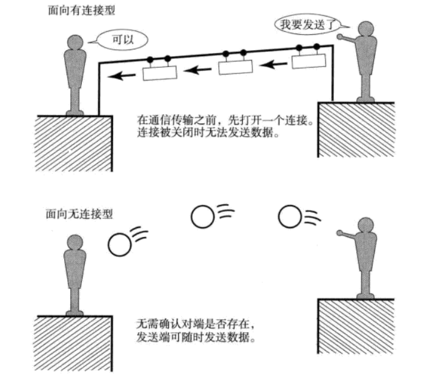

传输方式的分类
==============================================
网络与通信中可以根据其数据发送方法进行多种分类。
### 面向有连接型与面向无连接型
#### 面向有连接型
**面向有连接型中，在发送数据之前，需要在收发主机之间连接一条通信线路**。

面向有连接型就好比人们平常打电话，输入完对方电话号码拨出之后，只有对端拿起电话才能真正通话，
通话结束后将电话机扣上就如同切断电源。因此在面向有连接的方式下，必须在通信传输前后，专门进行建立
和断开连接的处理。如果与对端之间无法通信，就可以避免发送无谓的数据。

**注1**：在面向有连接型的情况下，发送端的数据不一定要分组发送。**TCP是以面向有连接的方式分组发送数据的**。
电路交换（后面介绍）虽然也属于面向有连接的一种方式，但是数据却并不仅限于分组发送。

**注2**：在不同的分层协议中，连接的具体含义可能有所不同。在 **数据链路层** 中的连接，就是指 **物理的，通信线路
的连接**。而 **传输层**则 **负责创建与管理逻辑上的连接**。
#### 面向无连接型
面向无连接型则不要求建立和断开连接。发送端可于任何时候自由发送数据。反之，接收端也永远不知道自己会在
何时从哪里收到数据。因此，在面向无连接的情况下，接收端需要时常确认是否收到了数据。

这就如同人们去邮局寄包裹一样。负责处理邮递业务的营业员，不需要确认收件人的详细地址是否真的存在，
也不需要确认收件人是否能收到包裹，只要发件人有一个寄件地址就可以办理邮寄包裹业务。

因此，**在面向无连接的通信中，不需要确认对端是否存在，即使接收端不存在或无法接收数据，发送端也能将数据
发送出去**。

**注**：**面向无连接型采用分组交换的情况多一些**，此时，可以直接将数据理解为分组数据。

### 电路交换与分组交换
