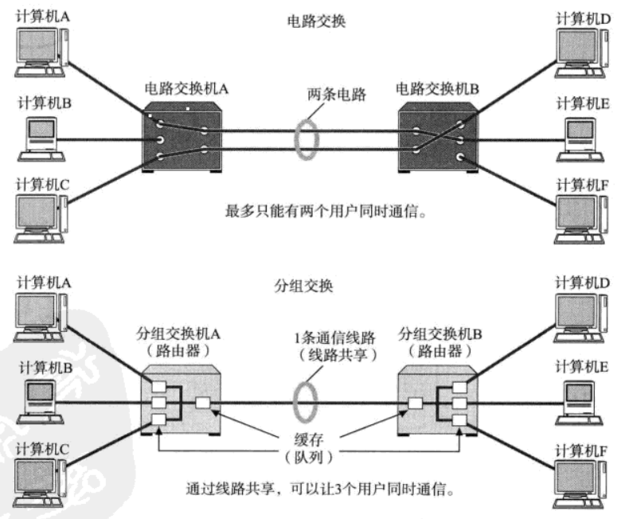
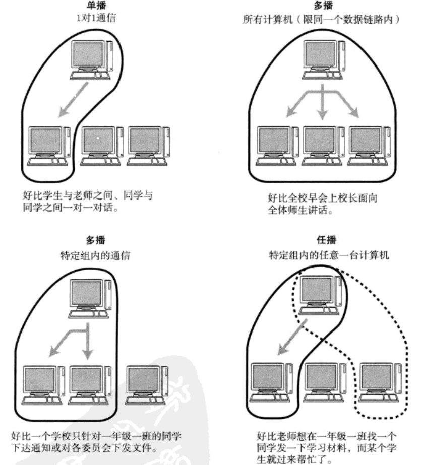

传输方式的分类
==============================================
网络与通信中可以根据其数据发送方法进行多种分类。
### 面向有连接型与面向无连接型
#### 面向有连接型
**面向有连接型中，在发送数据之前，需要在收发主机之间连接一条通信线路**。

面向有连接型就好比人们平常打电话，输入完对方电话号码拨出之后，只有对端拿起电话才能真正通话，
通话结束后将电话机扣上就如同切断电源。因此在面向有连接的方式下，必须在通信传输前后，专门进行建立
和断开连接的处理。如果与对端之间无法通信，就可以避免发送无谓的数据。

**注1**：在面向有连接型的情况下，发送端的数据不一定要分组发送。**TCP是以面向有连接的方式分组发送数据的**。
电路交换（后面介绍）虽然也属于面向有连接的一种方式，但是数据却并不仅限于分组发送。

**注2**：在不同的分层协议中，连接的具体含义可能有所不同。在 **数据链路层** 中的连接，就是指 **物理的，通信线路
的连接**。而 **传输层**则 **负责创建与管理逻辑上的连接**。
#### 面向无连接型
面向无连接型则不要求建立和断开连接。发送端可于任何时候自由发送数据。反之，接收端也永远不知道自己会在
何时从哪里收到数据。因此，在面向无连接的情况下，接收端需要时常确认是否收到了数据。

这就如同人们去邮局寄包裹一样。负责处理邮递业务的营业员，不需要确认收件人的详细地址是否真的存在，
也不需要确认收件人是否能收到包裹，只要发件人有一个寄件地址就可以办理邮寄包裹业务。

因此，**在面向无连接的通信中，不需要确认对端是否存在，即使接收端不存在或无法接收数据，发送端也能将数据
发送出去**。

**注**：**面向无连接型采用分组交换的情况多一些**，此时，可以直接将数据理解为分组数据。

### 电路交换与分组交换
目前，网络通信方式大致分为两种————电路交换与分组交换。电路交换技术的历史相对久远，主要用于过去的电话网。
而分组交换技术则是一种较新的通信方式。**TCP/IP，正是采用了分组交换技术**。

**在电路交换中，交换机主要负责数据的中转处理**。计算机首先被连接到交换机上，而交换机与交换机之间则由众多
通信线路再继续连接。因此计算机之间在发送数据时，需要通过交换机与目标主机建立通信电路。我们将连接电路称
为建立。建立好连接之后，用户就可以一直使用这条电路，直到连接被断开为止。

如果某条电路只是用来连接两台计算机的通信线路，就意味着只需在这两台计算机之间实现通信，因此这两台计算机是
可以独占线路进行传输的。但是，如果一条电路上连接了多台计算机，而这些计算机之间需要相互传递数据，就会出现
新的问题。**鉴于一台计算机在收发信息时会独占整个电路，其他计算机只能等待这台计算机处理结束以后才有机会使用
这条电路收发数据**。并且在此过程中，谁也无法预测某一台计算机的数据传输从何时开始又在何时结束。如果并发用户
数超过交换机之间的通信线路数，就意味着通信根本无法实现。

为此，人们想到了一个新的方法，即 **让连接到通信电路的计算机将所要发送的数据分成多个数据包，按照一定的顺序排列
之后分别发送，这就是分组交换**。有了分组交换，数据被细分后，所有的计算机就可以一齐收发数据，这样就 **提高了通信
线路的利用率**。**由于在分组的过程中，已经在每个分组的首部写入了发送端和接收端的地址，所以即使同一条线路
同时为多个用户提供服务，也可以明确区分每个分组数据发往的目的地，以及它是与哪台计算机进行的通信**。

在分组交换中，由分组交换机（路由器）连接通信线路。分组交换的大致处理过程是：**发送端计算机将数据分组发送
给路由器，路由器收到这些分组数据以后，缓存到自己的缓冲区，然后再转发给目标计算机**。因此，分组交换也有另一个
名称：蓄积交换。

**路由器接收到数据以后会按照顺序缓存到相应的队列当中，再以先进先出的顺序将它们逐一发送出去**。

在分组交换中，计算机与路由器之间以及路由器与路由器之间通常只有一条通信线路。在电路交换中，
计算机之间的传输速度不变。然而在分组交换中，通信线路的速度可能会有所不同。根据网络拥堵的情况，数据达到
目标地址的时间有长有短。另外，路由器的缓存饱和或溢出时，甚至可能会发生分组数据丢失，无法发送到对端的情况。

电路交换与分组交换图：

### 根据接收端数量分类
网络通信当中，也可以根据目标地址的个数及其后续的行为对通信进行分类。如广播，多播等就是这种分类的产物。
#### 单播（Unicast）
就是指 **1对1通信**。早先的固定电话就是单播通信的典型例子。
#### 广播（Broadcast）
就是将消息 **从1台主机发送给与之相连的所有其他主机**。广播通信的一个典型例子就是电视播放，它将电视信号一齐
发送给非特定的多个接收对象。

此外，我们知道电视信息一般都有自己的频段。只有在相应频段的可接收范围内才能收到电视信号。与之类似，
进行广播通信的计算机也有它们的广播范围。只有在这个范围之内的计算机才能收到相应的广播消息。这个范围叫做 **广播域**。
#### 多播（Multicast）
多播与广播类似，也是将消息发给多个接收主机。不同之处在于 **多播要限定某一组主机作为接收端**。
多播通信最典型的例子就是电视会议，这是由多组人在不同的地方参加的一种远程会议。在这种形式下，会由一台
主机发送消息给特定的多台主机。电视会议通常不能使用广播方式。否则将无从掌握是谁在哪儿参与电视会议。
#### 任播（Anycast）
任播是指 **在特定的多台主机中选出一台作为接收端的一种通信方式**。虽然，这种方式与多播有相似之处，
都是面向特定的一群主机，但是它的行为却与多播不同。任播通信从目标主机群中选择一台 **最符合网络条件的主机**
作为目标主机发送消息。通常，所被选中的那台特定主机将 **返回一个单播信号**，随后发送端主机会只跟这台主机进行通信。

