网络的构成要素
==========================================================
搭建一套网络环境要涉及各种各样的电缆和网络设备。在此仅介绍连接计算机与计算机的硬件设备。

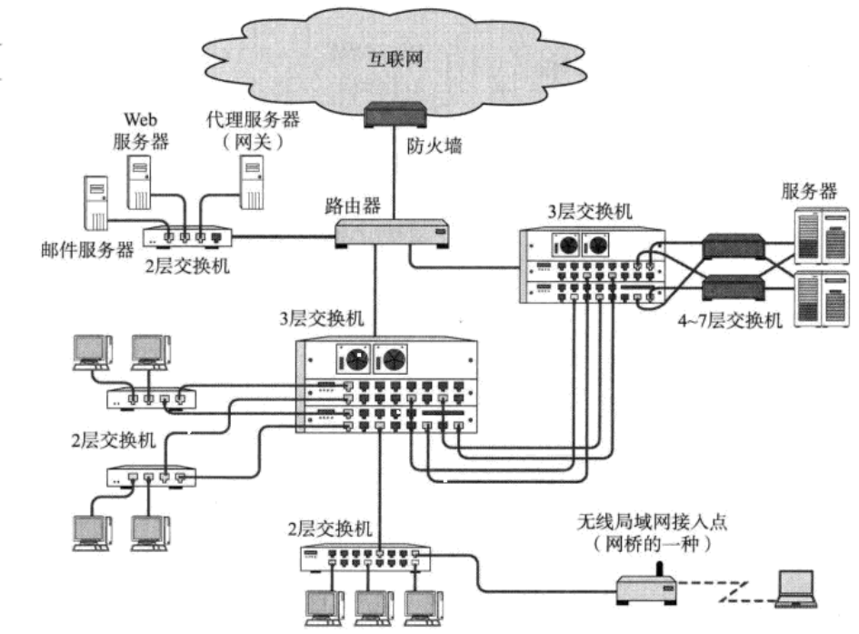

搭建网络的主要设备及其作用：

| 设备 | 作用 |
| :------------- | :------------- |
| 网卡 | 使计算机连网的设备 |
| 中继器 | 从物理层上延长网络的设备 |
| 网桥/2层交换机 | 从数据链路层上延长网络的设备 |
| 路由器/3层交换机 | 通过网络层转发分组数据的设备 |
| 4~7层交换机 | 处理传输层以上各层网络传输的设备 |
| 网关 | 转换协议的设备 |

### 通信媒介与数据链路
计算机之间通过电缆相互连接。电缆可以分为很多种，包括：双绞线电缆，光纤电缆，同轴电缆，串行电缆等。
根据数据链路（数据链路，意指相互直连的设备之间进行通信所涉及的协议及其网络。为此，有众多传输介质与之对应）
的不同选用的电缆类型也不尽相同。而媒介本身也可以被划分为电波，微波等不同类型的电磁波。

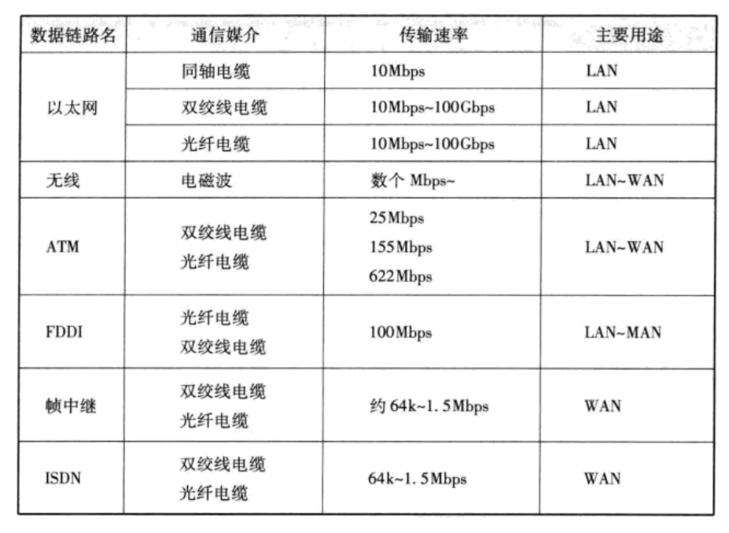

### 网卡
任何一台计算机连接网络时，必须要使用 **网卡**（全称为 **网络接口卡**）。网络接口卡有时也被叫做 **网络适配器**，
**网卡**，**LAN卡**。

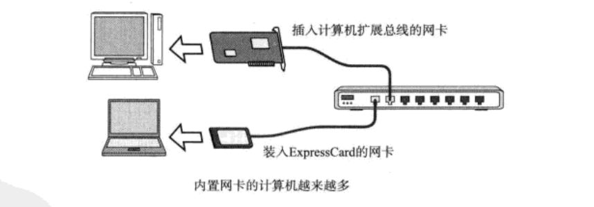

### 中继器
**中继器是在OSI模型的第1层————物理层面上延长网络的设备。由电缆传过来的电信号或光信号经由中继器
的波形调整和放大再传给另一个电缆**。

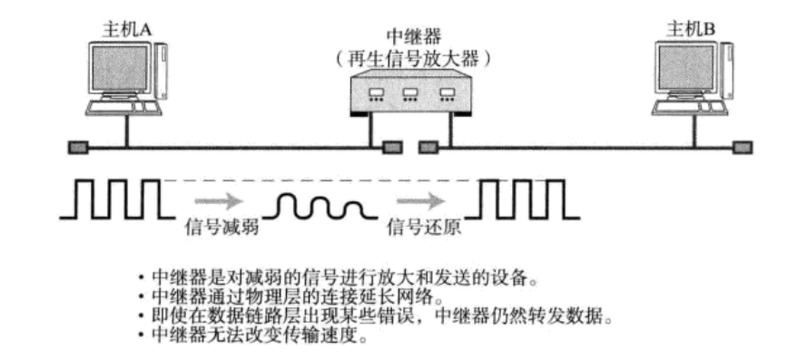

有些中继器可以提供多个端口服务。这种中继器被称作 **中继集线器** 或 **集线器**。因此，集线器也可以看作是多口中继器，
每个端口都可以成为一个中继器。

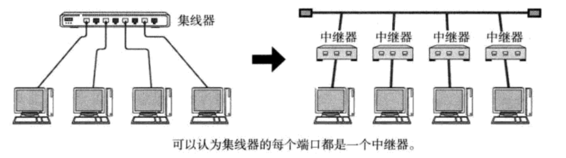

### 网桥/2层交换机

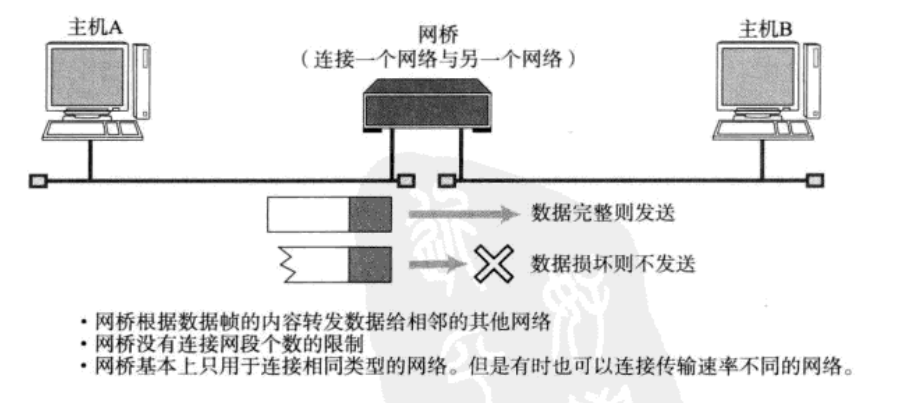

**网桥是在OSI模型的第2层————数据链路层面上连接两个网络的设备。它能够识别数据链路层中的数据帧，
并将这些数据帧临时存储于内存，再重新生成信号作为一个全新的帧发给相连的另一个网段**。网桥的作用就是
连接一个网络与另一个网络。

以太网等网络中经常使用的 **交换集线器** （Hub，具有网桥功能的Hub叫做交换集线器。只有中继器功能的Hub
叫做集线器），现在基本也属于网桥的一种。交换集线器中连接电缆的每个端口都能提供类似网桥的功能。

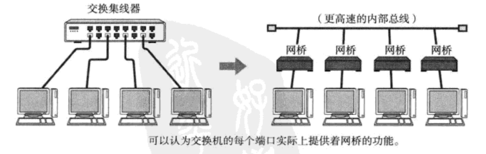

**注意：我们在局域网中常用的交换机，就是2层交换机，但跟网桥还是有些不一样的**！

### 路由器/3层交换机

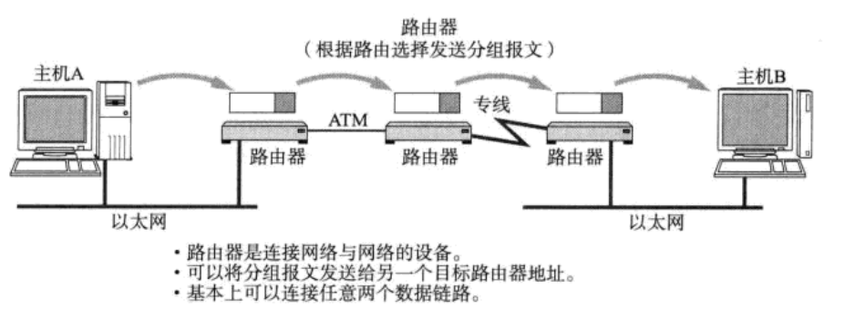

**路由器是在OSI模型的第3层————网络层面上连接两个网络，并对分组报文进行转发的设备**。网桥是根据物理地址（MAC地址）
进行处理，而路由器/3层交换机则是根据IP地址进行处理的。由此，TCP/IP中网络层的地址就成为了IP地址。

### 4～7层交换机

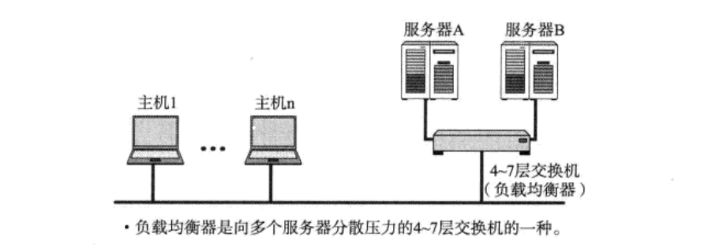

**4~7层交换机负责处理OSI模型中从传输层至应用层的数据。4~7层交换机就是以TCP等协议的传输层及其上面的应用层
为基础，分析收发数据，并对其进行特定的处理**。

例如，对于并发访问量非常大的一个企业级Web站点，使用一台服务器不足以满足前端的访问需求，这时通常会架设
多台服务器来分担。这些服务器前端访问的入口地址通常只有一个。为了能通过同一个URL将前端访问分发到后台
多个服务器上，可以在这些服务器的前端加一个负载均衡器。这种负载均衡器就是4~7层交换机的一种。比如：F5负载均衡设备！

此外，实际通信当中，人们希望在网络比较拥堵的时候，优先处理像语言这类对及时性要求较高的通信请求，
放缓处理像邮件或数据转发等稍有延迟也并无大碍的通信请求。这种处理被称为带宽控制，也是4~7层交换机的
重要功能之一。

除此之外，4~7层交换机的应用场景还有很多。例如广域网加速器，特殊应用访问加速以及防火墙等。

### 网关

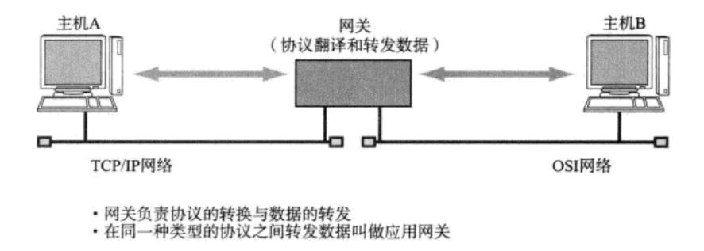

**网关是OSI参考模型中负责将从传输层到应用层的数据进行转换和转发的设备**。它与4~7层交换机一样都是处理传输层及以上的数据，
但是 **网关不仅转发数据还负责对数据进行转换，它通常会使用一个表示层或应用层网关，在两个不能进行直接通信的协议
之间进行翻译，最终实现两者之间的通信**。

一个非常典型的例子就是 **互联网邮件与手机邮件之间的转换服务**。手机邮件有时可能会与互联网邮件互不兼容，
这是由于它们在表示层和应用层中的“电子邮件协议”互不相同所导致的。

那么，为什么连到互联网的电脑与手机之间能够互发电子邮件呢？如图：

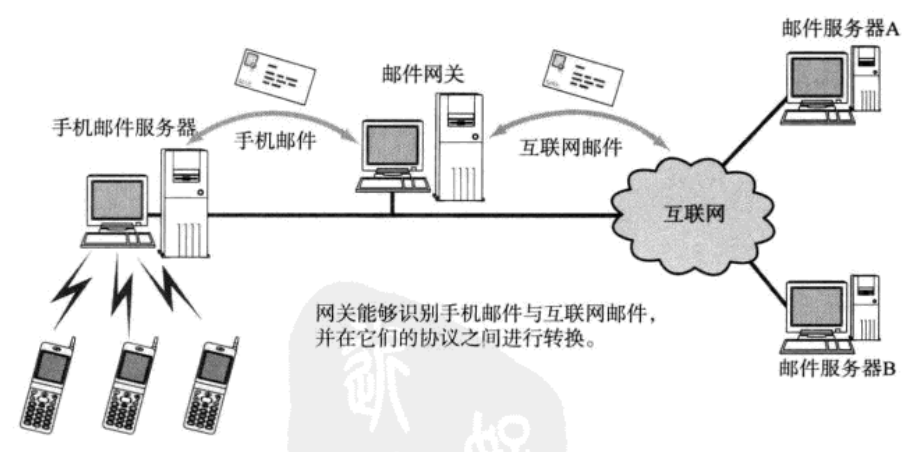

互联网与手机之间设置了一道网关。网关负责读取完各种不同的协议后，对它们逐一进行合理的转换，再将相应的数据转发出去。
这样一来即使应用的是不同电子邮件的协议；计算机与手机之间也能互相发送邮件。

此外，在使用www（万维网）时，**为了控制网络流量以及出于安全的考虑，有时会使用代理服务器**（Proxy Server）。
**这种代理服务器也是网关的一种，称为应用网关**。有了代理服务器，客户端与服务器之间无需在网络层上直接通信，
面是从传输层到应用层对数据和访问进行各种控制和处理。防火墙就是一款通过网关通信，针对不同应用提高安全性的产品。

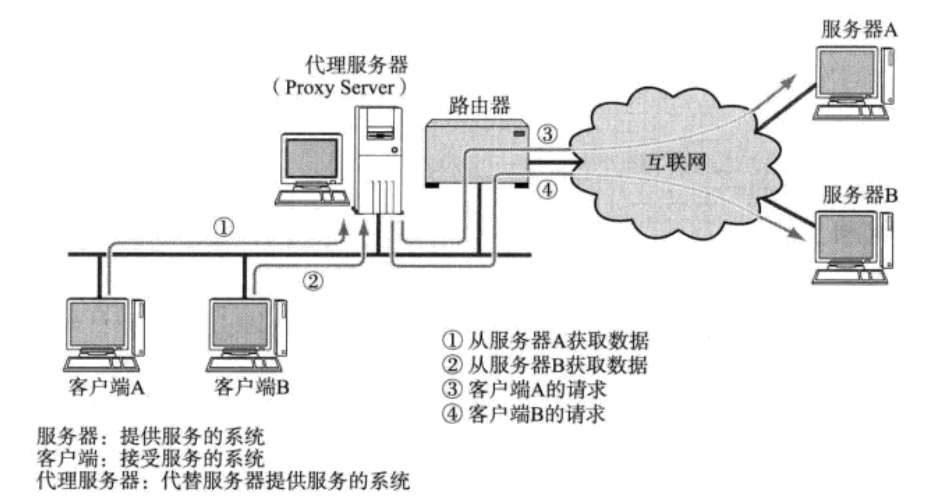
