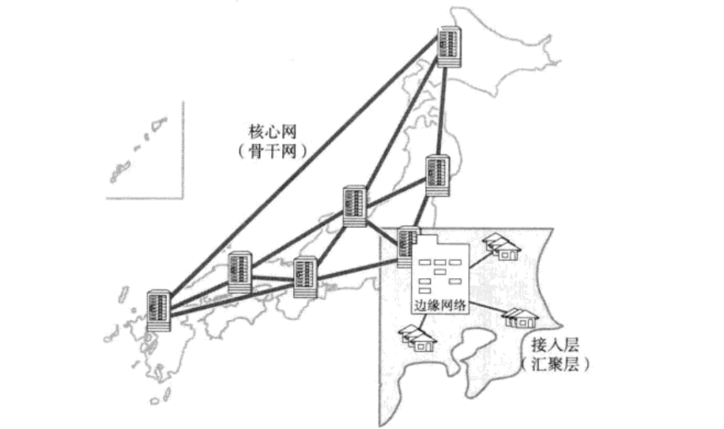
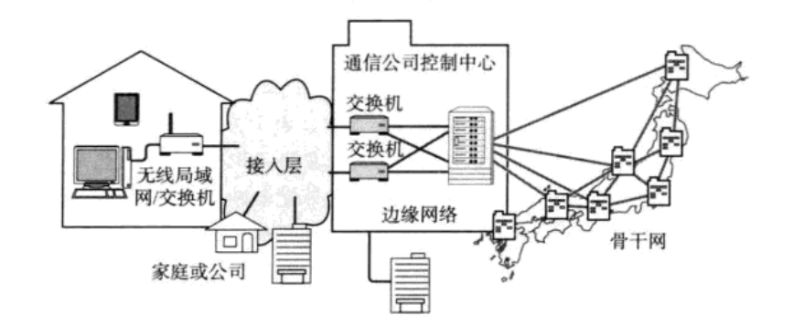
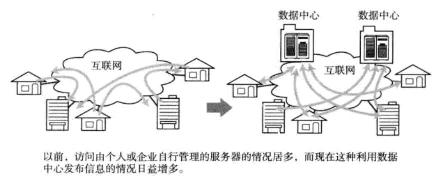

现代网络实态
================================================================
### 网络的构成
首先，我们以交通道路为例说明现实当中的网络配置。

每座大型城市的道路交通网中，或多或少都分布着高速公路。在计算机网络中有类似高速公路的部分，人们称为
**“骨干网”或“核心网”**。正如其名，它们是计算机网络的中心。人们通常会选用 **高速路由器** 相互连接使之快速传输大量数据。

网络中相应于高速公路出入口的部分被称作 **“边缘网络”**。常用的设备有 **多功能路由器** 和 **3层交换机**。

高速公路的出入口通常连接国道，省道，从而可以通往市区街道。计算机网络中连接“边缘网络”的部分叫做 **“接入层”** 或 **“汇聚层”**。
这样，**骨干网可以专注于如何提高业务传输性能和网络的生存性，而将具有业务智能化的高速路由器和交换机移到网络
的边缘**。边缘网络的常用设备多为 **2层交换机** 或 **3层交换机**。

### 互联网通信

人们在家里或公司连接互联网时，一般会使用互联网接入服务。联网之后，汇集到无线局域网路由器和最近交换机
的通信会再次被连接到前面所提到的“接入层”。甚至还有可能通过“边缘网络”或“主干网络”实现与目标地址之间的通信。

### 移动通信
**手机一开机，就会自动与距离最近的基站发生无线通信**。基站上设有特定手机基站天线，基站本身也相当于网络的 **“接入层”**。

由一部手机终端发送信号给另一个终端时，它所发出的请求会一直传送到注册对端手机号码的基站，如果对方接听了电话，
就等于在这两部手机之间建立了通信连接。

基站收集的通信请求被汇集到控制中心（**“边缘网络”**），之后会再被接入到互连通信控制中心的 **主干网**。
这种手机网络的构成与互联网接入服务非常相似。

### 从信息发布者的角度看网络
提到网络信息传播，以往比较主流的做法是，个人和企业自己制作网站（主页）部署到服务器中将所要发布的信息公之于众。
而现在，通过博客，**托管主机服务**（托管主机服务是指 **将用于信息发布的主机放置于互联网数据中心的机房，
或者从该机房租赁一台计算机作为发布信息主机的服务**）的案例日渐增多。**这种方式的一大优点是不需要做服务器运维
的管理，只需要关注自己所要发布信息的特定网站即可**。

**面对高并发的访问量，托管主机服务，为了减少访问延迟，会集合多个存储于一起，通过连接高速网络，以期提高响应速度**。
这种方式被人们称作 **数据中心**。

**数据中心由大型服务器，存储以及计算机网络构成。有些大型的数据中心甚至直接连接“主干网”。即使小规模的数据中心，
大多数情况下也会连接到"边缘网络"**。

