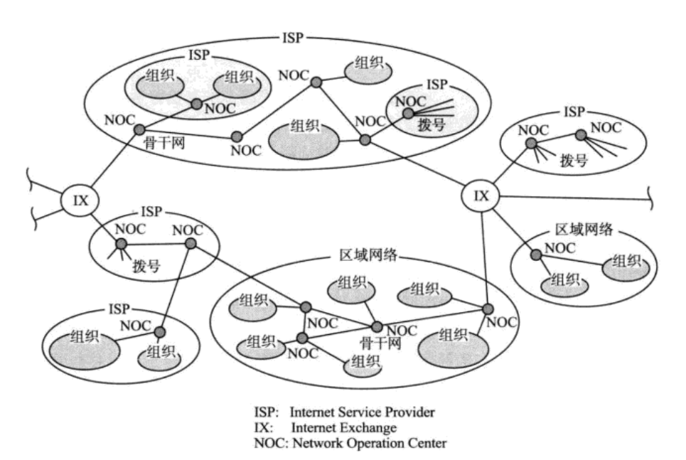

互联网基础知识
==============================================================
### 互联网定义
“互联网”，英文单词为“Internet”。从字面上理解，**`Internet`指的是将多个网络连接使其构成一个更大的网络**，
所以`Internet`一词本意为 **网际网**。将两个以太网网段用路由器相连是互联网，将企业内部各部门的网络或公司的
内网与其他企业相连，并实现相互通信的网络也是互联网，甚至一个区域的网络与另一个区域的网络相互连接形成全世界规模
的网络也可以称作互联网。然而，现在“互联网”这个词的意思却有所变化。**当专门指代网络之间的连接时，可以使用”网际网”
这个词**。

**“互联网”是指由`ARPANET`发展而来、互连全世界的计算机网络**。现在，“互联网”已经是一个专有名词了，其对应的英文
单词“The Internet”，也早已成为固有名词（`Internet`指网际网，`The Internet`指互联网）。

### 互联网与TCP/IP的关系
互联网进行通信时，需要相应的网络协议，**TCP/IP原本就是为使用互联网而开发制定的协议族**。因此，互联网的协议就是
TCP/IP，TCP/IP就是互联网的协议。

### 互联网的结构
互联网一词原意是网际网，意指连接一个又一个网络。那么连接全世界的互联网也是如此。**较小范围的网络之间相连
组成机构内部的网络，机构内部的网络之间相连再形成区域网络，而各个区域网络之间再互连，最终就形成了连接全
世界的互联网**。互联网就是按照这样的形式构成了一个 **有层次的网络**。

互联网中的每个网络都是由 **骨干网** 和 **末端网** 组成的。每个网络之间通过 **NOC**（Network Operation Center,
网络操作中心）相连。如果网络的运营商不同，它的网络连接方式和使用方法也会不同。连接这种异构网络需要有 **IX**（Internet Exchange,
网络交换中心）的支持。总之，**互联网就是众多异构的网络通过IX互连的一个巨型网络**。

### ISP和区域网
连接互联网需要向`ISP`（Internet Service Provider，**为个人、公司或教育机构等提供互联网接入服务的供应商**）
或区域网提出申请。公司企业或一般家庭申请入网只要联系`ISP`签约即可。

不同的`ISP`所提供的互联网接入服务的项目也不同。例如，不限流量包月、限定上网时限以及有线/无线网络连接等
各样的服务。

所以人们在实际申请连网前，最好先确认一下`ISP`或区域网所对应的具体服务条目、所提供服务的细则（如接入方式，
条件、费用等）等，然后再结合自己的使用目的做决定。
