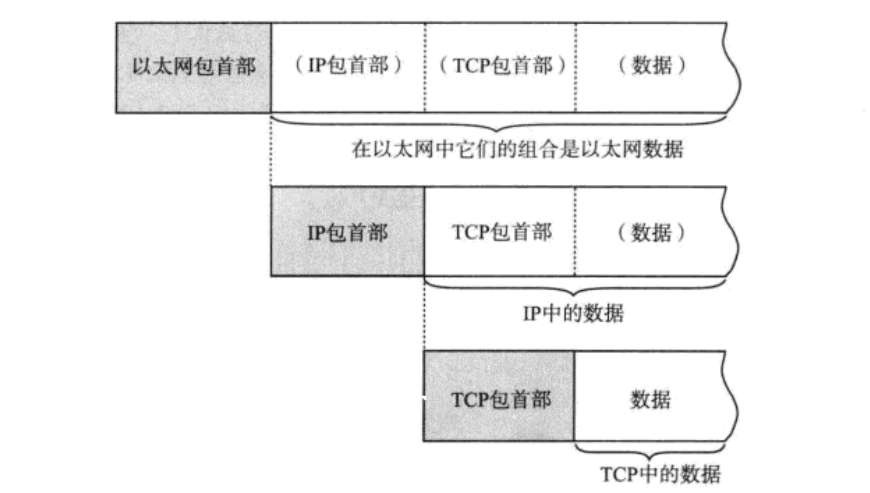
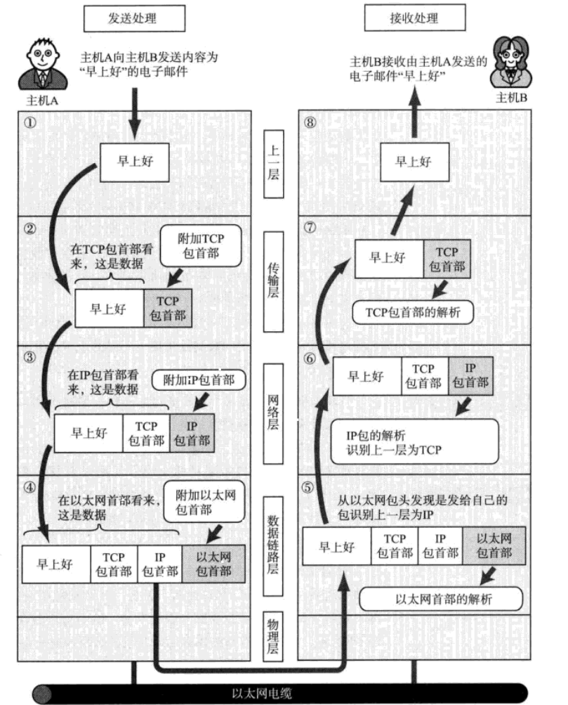
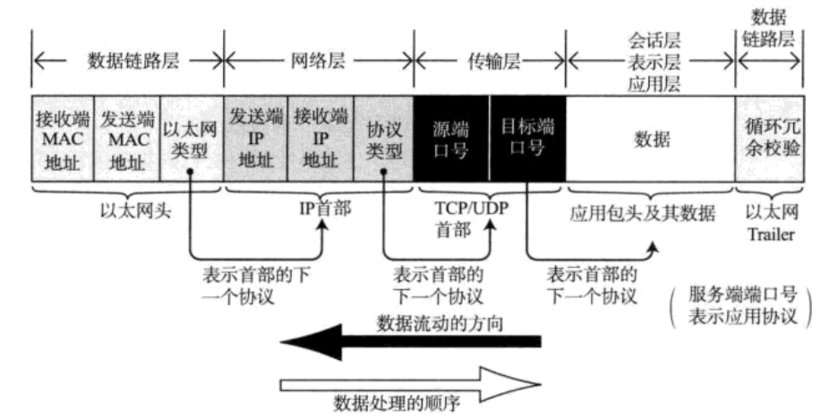

TCP/IP分层模型与通信示例
==================================================================
### 数据包首部

每个分层中，都会对所发送的数据附加一个首部，在这个首部中包含了该层必要的信息，如发送的目标地址以及协议
相关信息。通常，为协议提供的信息为包首部，所要发送的内容为数据。在下一层的角度看，从上一分层收到的包全
部都被认为是本层的数据。

**注意：包、帧、数据报、段、消息**

以上五个术语都用来表述数据的单位，大致区分如下：

**包** 可以说是 **全能性** 术语。**帧** 用于表示 **数据链路层** 中包的单位。而 **数据报** 是 **`IP`**
和 **`UDP`** 等网络层以上的分层中包的单位。**段** 则表示 **`TCP`** 数据流中的信息。最后，
**消息** 是指 **应用协议** 中数据的单位。

### 发送数据包
假设甲给乙发送电子邮件，内容为：“早上好”。而从TCP/IP通信上看，是从一台计算机A向另一台计算机B发送电子邮件。

#### 1.应用程序处理
启动应用程序新建邮件，将收件人邮箱填好，再由键盘输入邮件内容“早上好”，鼠标点击“发送”按钮就可以开始
TCP/IP的通信了。

**首先，应用程序中会进行编码处理**。例如，中文电子邮件使用GBK或UTF-8进行编码。这些编码 **相当于OSI的表示层功能**。
编码转化后，实际邮件不一定会马上被发送出去，因为有些邮件的软件有一次同时发送多个邮件的功能，**像这种何时
建立通信连接何时发送数据的管理功能，从某种宽泛的意义上看属于OSI参考模型中会话层的功能**。

应用在发送邮件的那一刻建立TCP连接，从而利用这个TCP连接发送数据。它的过程首先是 **将应用的数据发送给下一层
的TCP**，再做实际的转发处理。

#### 2.TCP模型的处理
TCP根据应用的指示，**负责建立连接、发送数据以及断开连接**。TCP提供将应用层发来的数据顺利发送至对端的可靠传输。
为了实现TCP的这一功能，**需要在应用层数据的前端附加一个TCP首部**。TCP首部中包括源端口号和目标端口号、
序号以及校验和。**随后将附加了TCP首部的包再发送给IP**。

### 3.IP模块的处理
**IP将TCP传过来的TCP首部和TCP数据合起来当做自己的数据，并在TCP首部的前端再加上自己的IP首部**。因此，
IP数据包中IP首部后面紧跟着TCP首部，然后才是应用的数据首部和数据本身。IP首部中包含接收端IP地址以及发送端IP地址。
紧随IP首部的还有用来判断其后面数据是TCP还是UDP的信息。

**IP包生成后，参考路由控制表决定接受此IP包的路由或主机**。随后，IP包将被发送给连接这些路由器或主机网络接口
的驱动程序，以实现真正发送数据。

**如果尚不知道接收端的MAC地址，可以利用ARP查找**。只要知道了对端的MAC地址，就可以将MAC地址和IP地址交给以太网
的驱动程序，实现数据传输。

#### 4.网络接口（以太网驱动）的处理
从IP传过来的IP包，对于以太网驱动来说不过就是数据。给这数据附加上以太网首部并进行发送处理。以太网首部中包含
接收端MAC地址、发送端MAC地址以及标志以太网类型的以太网数据的协议。根据上述信息产生的以太网数据包将通过物理
层传输给接收端。

### 经过数据链路的包
分组数据包经过以太网的数据链路时的大致流程如下图：

包流动时，从前往后依此被附加了以太网包首部、IP包首部、TCP包首部（或者UDP包首部）以及应用自己的包首部和数据。
而包的最后则追加了以太网包尾。

每个包首部中至少都会包含两个信息：**一个是发送端和接收端地址，另一个是上一层的协议类型**。

经过每个协议分层时，都必须有识别包发送端和接收端的信息。以太网会用MAC地址，IP会用IP地址，而TCP/UDP则会
用端口号作为识别两端主机的地址。

### 数据包接收处理
**包的接收流程是发送流程的逆序过程**。

#### 5.网络接口（以太网驱动）的处理
主机收到以太网包以后，首先从以太网的包首部找到MAC地址判断是否为发给自己的包。如果不是发给自己的包则丢弃数据。
而如果接收到了恰好是发给自己的包，就查找以太网包首部中的类型域从而确定以太网协议所传送过来的数据类型。
在这个例子中数据类型显然是IP包，因此再将数据传给处理IP的子程序，如果这时不是IP而是其他诸如ARP的协议，
就把数据传给ARP处理。总之，如果以太网包首部的类型域包含了一个无法识别的协议类型，则丢弃数据。

#### 6.IP模块的处理
IP模块收到IP包首部及后面的数据部分以后，也做类似的处理。如果判断得出包首部中的IP地址与自己的IP地址匹配，
则可接收数据并从中查找上一层的协议。如果上一层是TCP就将IP包首部之后的部分传给TCP处理。如果是UDP则将
IP包首部后面的部分传给UDP处理。对于有路由器的情况下，接收端地址往往不是自己的地址，此时，需要借助路由
控制表，在调查应该送达的主机或路由器以后再转发数据。

#### 7.TCP模块的处理
在TCP模块中，首先会计算一下校验和，判断数据是否被破坏。然后检查是否在按照序号接收数据。最后检查端口号，
确定具体的应用程序。

数据接收完毕后，接收端则发送一个“确认回执”给发送端。如果这个回执信息未能达到发送端，那么发送端会认为
接收端没有接收到数据而一直反复发送。数据被完整地接收以后，会传给由端口号识别的应用程序。

#### 8.应用程序的处理
接收端应用程序会直接接收发送端发送的数据。略......
