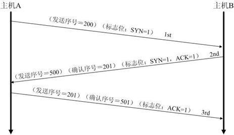
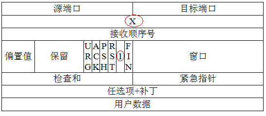
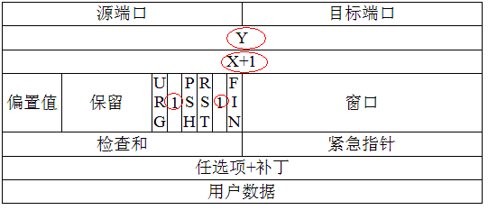
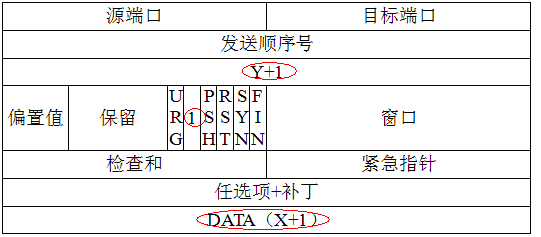

TCP的三次握手(建立连接）和四次挥手(关闭连接)
======================================================================
### TCP三次握手建立连接

#### 第一次握手
客户端发送一个`TCP`的`SYN`标志位置`1`的包，指明客户打算连接的服务器的端口，以及初始序号`X`,
保存在包头的序列号(`Sequence Number`)字段里。

#### 第二次握手
服务器发回确认包(`ACK`)应答。即`SYN`标志位和`ACK`标志位均为`1`同时，
将确认序号(`Acknowledgement Number`)设置为客户的`ISN`加`1`，即`X+1`。

#### 第三次握手
客户端再次发送确认包(`ACK`) ，`SYN`标志位为`0`，`ACK`标志位为`1`。并且把服务器发来`ACK`的序号字段加`1`，
放在确定字段中发送给对方，并且在数据段放写`ISN`的加`1`，即`Y+1`。

### TCP四次挥手关闭连接
**由于`TCP`连接是全双工的，因此每个方向都必须单独进行关闭**。这个原则是 **当一方完成它的数据发送任务后就能发送
一个`FIN`来终止这个方向的连接**。收到一个`FIN`只意味着这一方向上没有数据流动，一个`TCP`连接在收到一个`FIN`后仍能
发送数据。首先进行关闭的一方将执行主动关闭，而另一方执行被动关闭。
1. 客户端`A`发送一个`FIN`，用来关闭客户`A`到服务器`B`的数据传送。
2. 服务器`B`收到这个`FIN`，它发回一个`ACK`，确认序号为收到的序号加`1`。和`SYN`一样，一个`FIN`将占用一个序号。
3. 服务器`B`关闭与客户端`A`的连接，发送一个`FIN`给客户端`A`。
4. 客户端`A`发回`ACK`报文确认，并将确认序号设置为收到序号加`1`。
