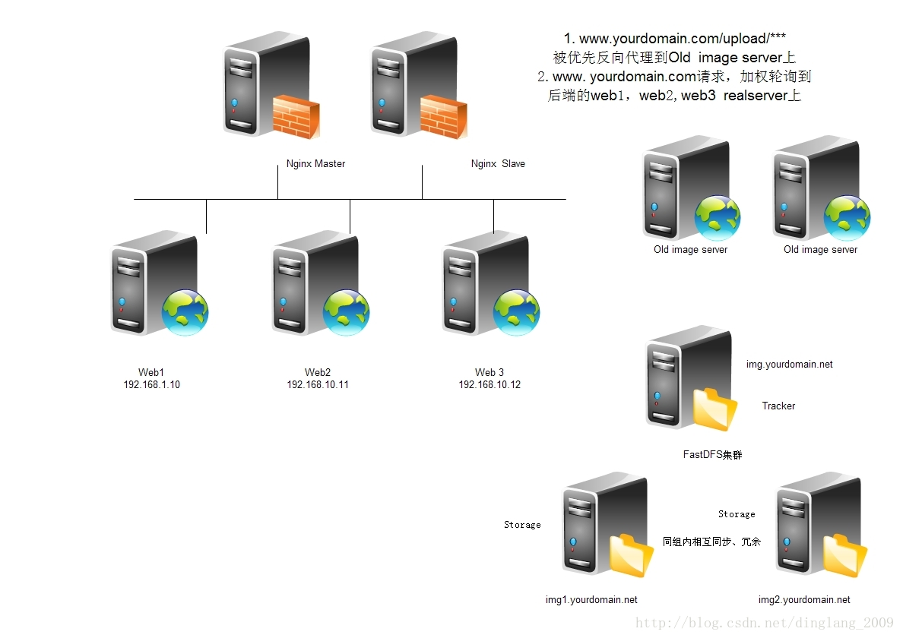

图片服务器架构（分布式文件系统+CDN）
==================================================================
早期的图片服务器架构，在上传/下载操作时，都经过了Web服务器（虽然共享存储的这种架构，也可以配置独立域名和站点来提供图片访问，
但上传写入仍然得经过Web服务器上的应用程序来处理），这对Web服务器来讲无疑是造成巨大的压力。所以，
更建议使用独立的图片服务器和独立的域名，来提供用户图片的上传和访问。

### 独立图片服务器/独立域名的好处

1. 图片访问是很消耗服务器资源的（因为会涉及到操作系统的上下文切换和磁盘I/O操作）。分离出来后，`Web/App`服务器可以更专注发挥动态处理的能力。
2. 独立存储，更方便做扩容、容灾和数据迁移。
3. 浏览器（相同域名下的）并发策略限制，性能损失。
4. 访问图片时，请求信息中总带`cookie`信息，也会造成性能损失。
5. 方便做图片访问请求的负载均衡，方便应用各种缓存策略（`HTTP Header`、`Proxy Cache`等），也更加方便迁移到CDN。

我们可以使用`Lighttpd`或者`Nginx`等轻量级的web服务器来架构独立图片服务器。

### 当前的图片服务器架构（分布式文件系统+CDN）
在构建当前的图片服务器架构之前，可以先彻底撇开web服务器，直接配置单独的图片服务器/域名。但面临如下的问题：

1. 旧图片数据怎么办（如果有遗留的旧图片数据）？能否继续兼容旧图片路径访问规则？
2. 独立的图片服务器上需要提供单独的上传写入的接口（服务API对外发布），安全问题如何保证？
3. 同理，假如有多台独立图片服务器，是使用可扩展的共享存储方案，还是采用实时同步机制？

直到应用级别的（非系统级）`DFS`（例如`FastDFS`，`HDFS`，`MogileFs`，`MooseFS`、`TFS`）的流行，
简化了这个问题：**执行冗余备份、支持自动同步、支持线性扩展、支持主流语言的客户端`api`上传/下载/删除等操作，
部分支持文件索引，部分支持提供Web的方式来访问**。

考虑到各`DFS`的特点，客户端`API`语言支持情况(需要支持`Java`)，文档和案例，以及社区的支持度，我们最终选择了`FastDFS`来部署。

唯一的问题是：可能会不兼容旧版本的访问规则。如果将旧图片一次性导入`FastDFS`，但由于旧图片访问路径分布存储在不同业务数据库的各个表中，
整体更新起来也十分困难，所以必须得兼容旧版本的访问规则。**架构升级往往比做全新架构更有难度**，就是因为还要兼容之前版本的问题。

**解决方案如下：**

首先，关闭旧版本上传入口（避免继续使用导致数据不一致）。将旧图片数据通过`rsync`工具一次性迁移到独立的图片服务器上
（即下图中描述的`Old ImageServer`）。在最前端(七层代理，如`Haproxy`、`Nginx`)用`ACL`（访问规则控制），
将旧图片对应`URL`规则的请求（正则）匹配到，然后将请求直接转发指定的`web`服务器列表，
在该列表中的服务器上配置好提供图片（以`Web`方式）访问的站点，并加入缓存策略。这样实现旧图片服务器的分离和缓存,
兼容了旧图片的访问规则并提升旧图片访问效率，也避免了实时同步所带来的问题。

整体架构如图：

基于`FastDFS`的独立图片服务器集群架构，虽然已经非常的成熟，但是由于国内“南北互联”和`IDC`带宽成本等问题（图片是非常消耗流量的），
我们最终还是选择了商用的`CDN`技术，实现起来也非常容易，原理其实也很简单，我这里只做个简单的介绍：

**将`img`域名`cname`到`CDN`厂商指定的域名上，用户请求访问图片时，则由`CDN`厂商提供智能DNS解析，将最近的（当然也可能有其它更复杂的策略，
例如负载情况、健康状态等）服务节点地址返回给用户，用户请求到达指定的服务器节点上，该节点上提供了类似`Squid/Vanish`的代理缓存服务，
如果是第一次请求该路径，则会从源站获取图片资源返回客户端浏览器，如果缓存中存在，则直接从缓存中获取并返回给客户端浏览器，完成请求/响应过程**。

由于采用了商用`CDN`服务，所以我们并没有考虑用`Squid/Vanish`来重复构建前置代理缓存。

上面的整个集群架构，可以很方便的做横向扩展，能满足一般垂直领域大型网站的图片服务需求（当然，像`taobao`这样超大规模的可能另当别论）。
**经测试，提供图片访问的单台`Nginx`服务器（至强E5四核CPU、16G内存、SSD），对小静态页面（压缩后的）可以扛住上万的并发且毫无压力**。
当然，由于图片本身体积比纯文本的静态页面大很多，提供图片访问的服务器的抗并发能力，往往会受限于磁盘的`I/O`处理能力和`IDC`提供的带宽。
`Nginx`的抗并发能力还是非常强的，而且对资源占用很低，尤其是处理静态资源，似乎都不需要有过多担心了。可以根据实际访问量的需求，
通过调整`Nginx`参数，`Linux`内核调优、缓存策略等手段做更大程度的优化，也可以通过增加服务器或者升级服务器配置来做扩展，
最直接的是通过购买更高级的存储设备和更大的带宽，以满足更大访问量的需求。

值得一提的是，**在“云计算”流行的当下，也推荐高速发展期间的网站，使用“云存储”这样的方案，既能帮你解决各类存储、扩展、
备灾的问题，又能做好CDN加速。最重要的是，价格也不贵**。

总结，有关图片服务器架构扩展，大致围绕这些问题展开：

1. 容量规划和扩展问题。
2. 数据的同步、冗余和容灾。
3. 硬件设备的成本和可靠性（是普通机械硬盘，还是`SSD`，或者更高端的存储设备和方案）。
4. 文件系统的选择。根据文件特性（例如文件大小、读写比例等）选择是用`ext3/4`或者`NFS/GFS/TFS`这些开源的（分布式）文件系统。
5. 图片的加速访问。采用商用`CDN`或者自建的代理缓存、`web`静态缓存架构。
6. 旧图片路径和访问规则的兼容性，应用程序层面的可扩展，上传和访问的性能和安全性等。
