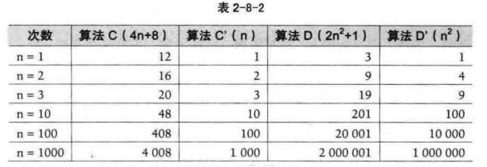

函数的渐近增长
==============================================================
我们现在来判断一下，两个算法A和B哪个更好。假设两个算法的输入规模都是`n`，算法A要做`2n+3`次操作，
你可以理解为先有一个`n`次的循环，执行完成后，再有一个`n`次循环，最后有3次赋值或运算，共`2n+3`次操作。
算法B要作`3n+1`次操作。你觉得它们谁更快呢？

准确来说，**答案是不一定的**。

当`n=1`时，算法A效率不如算法B；而当`n=2`时，两者效率相同；当`n>2`时，算法A就开始优于算法B了，
随着`n`的增加，算法A比算法B越来越好了。于是我们可以得出结论，算法A总体上要好过算法B。

此时我们给出这样的定义，输入规模`n`在没有限制的情况下，只要超过一个 **数值N** ，这个函数就总是大于
另一个函数，我们称函数是渐近增长的。

> **函数的渐近增长：给定两个函数`f(n)`和`g(n)`，如果存在一个整数N，使得对于所有的`n>N`，`f(n)`总是
> 比`g(n)`大，那么，我们说`f(n)`的渐近增长快于`g(n)`**。

从中我们发现，随着`n`的增大，后面的`+3`还是`+1`其实是不影响最终的算法变化的，例发算法A'与算法B'，
所以，我们 **可以忽略这些加法常数**。后面的例子，这样的常数被忽略的意义可能会更加明显。

我们来看第二个例子，算法C是`4n+8`，算法D是`2n2+1`：

当`n<=3`的时候，算法C要差于算法D，但当`n>3`后，算法C的优势就越来越优于算法D了，到后来更是远远胜过。
而当后面的常数去掉后，我们发现其实结果没有发生改变。甚至我们再观察发现，哪怕去掉与`n`相乘的常数，
这样的结果也没发生改变，算法C'的次数随着`n`的增长，还是远小于算法D'。也就是说，**与最高次项相乘的常数并不重要**。
