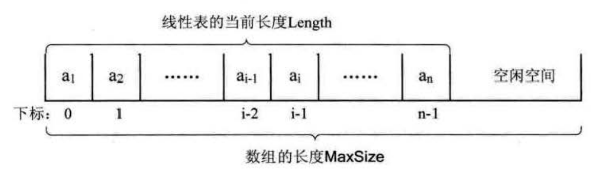

线性表的顺序存储结构
================================================================
### 顺序存储定义
这里我们来看看 **线性表的两种物理结构** 的第一种————顺序存储结构。**线性表的顺序存储结构，
指的是用一段地址连续的存储单元依次存储线性表的数据元素**。

线性表（a1,a2,......,an）的顺序存储示意图如下：


### 顺序存储方式
线性表的顺序存储结构，就是在内存中找了块地儿，通过占位的形式，把一定内存空间给占了，然后把相同数据类型的数据
元素依次存放在这块空地中。即然线性表的每个数据元素的类型都相同，**所以可以用`C`语言（其它语言也相同）的
一维数组来实现顺序存储结构**，即把第一个数据元素存到数组下标为0的位置，接着把线性表相邻的元素存储在数组中
相邻的位置。

来看线性表的顺序存储的结构代码：
```c
# define MAXSIZE 20           /*存储空间初始分配量*/
typedef int ElemType;         /*ElemType类型根据实际情况而定，这里假设为int*/
typedef struct
{
    ElemType data[MAXSIZE];
    int length;
}SqList;
```
这里，我们就发现描述顺序存储结构需要三个属性：
+ 存储空间的起始位置：数组data，它的存储位置就是存储空间的存储位置。
+ 线性表的最大存储容量：数组长度MaxSize。
+ 线性表的当前长度：length。

### 数据长度与线性表长度区别
注意，“数组的长度”和“线性表的长度”需要区分一下。数组的长度是存放线性表的存储空间的长度，存储分配后
这个量一般是不变的。线性表的长度是线性表中数据元素的个数，随着线性表插入和删除操作的进行，这个量是变化的。
在任意时刻，线性表的长度应该小于等于数组的长度。

### 地址计算方法
由于我们数数都是从1开始数的，线性表的定义也不能兔俗，起始也是1，可C语言中的数组却是从0开始第一个下标的，
于是线性表的第i个元素是要存储在数组下标为i-1的位置，即数据元素的序号和存放它的数组下标之间存在对应关系：



其实，内存中的地址，就和图书馆或电影院里的座位一样，都是有编号的。存储器中的每个存储单元都有自己的编号，
这个编号称为地址。

由于每个数据元素，不管它是整型，实型还是字符型，它都是需要占用一定的存储单元空间的。假设一个元素占用的是c个存储单元，
那么线性表中第i+1个数据元素的存储位置和第i个数据元素的存储位置满足下列关系（`LOC`表示获得存储位置
的函数)。
```
LOC(ai+1) = LOC(ai) + c
```
所以对于第i个数据元素ai的存储位置可以由a1推算得出：
```
LOC(ai) = LOC(a1) + (i-1)*c
```
