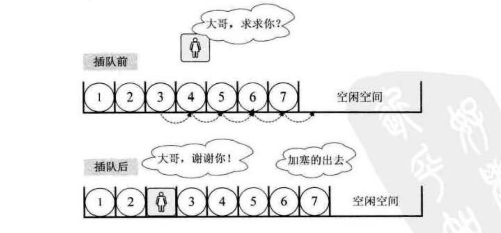
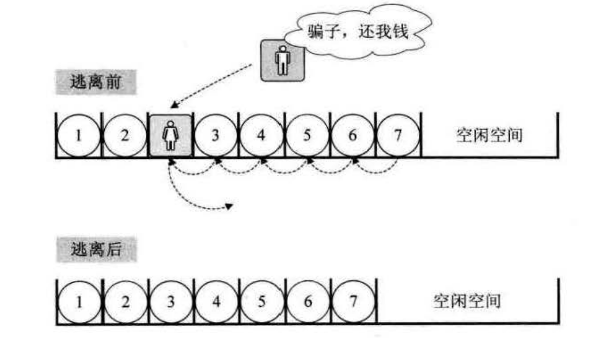
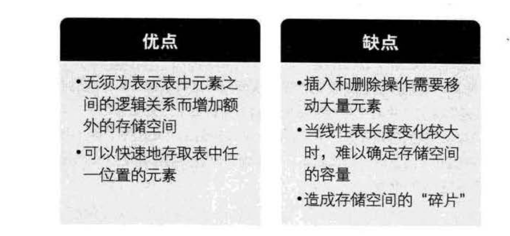

顺序存储结构的插入与删除
=============================================================
### 获得元素操作
对于线性袤的顺序存储结构来说，如果我们要实现`GetElem`操作（见前面ADT定义示例），即将线性表L中的第`i`个位置
元素值返回，其实是非常简单的。就程序而言，只要i的数值在数组下标范围内，就是把数组第`i-1`下标的值返回即可。

### 插入操作
刚才我们也谈到，这里的时间复杂度为`O(1)`。我们现在来考虑，如果我们要实现`Listlnsert(*L,i,e)`，
即在线性表`L`中的第`i`个位置插入新元素`e`，应该如何操作？

举个例子，本来我们在春运时去买火车票，大家都排队排的好好的。这时来了一个美女，对着队伍中排在第三位的你说，
"大哥，求求你帮帮忙，我家母亲有病，我得急着回去看她，这队伍这么长，你可否让我排在你的前面? "你心一软，
就同意了。这时，你必须得退后一步，否则她是没法进到队伍来的。这可不得了，**后面的人像儒虫一样，全部都得退一步**。
骂起四声。但后面的人也不清楚这加塞是怎么回事，没什么办法。

这个例子其实已经说明了线性表的顺序存储结构，在插入数据时的实现过程：

这里具体的实现代码就不写出来了！！！！

### 删除操作
接着刚才的例子。此时后面排队的人群意见都很大，都说怎么可以这样，不管什么原因，插队就是不行，有本事，
找火车站开后门去。就在这时，远处跑来一胖子，对着这美女喊，可找到你了，你这骗子，还我钱。只见这女子二话不说，
突然就冲出了队伍，胖子追在其后消失在人群中。哦，原来她是倒卖火车票的黄牛，刚才还装可怜。**于是排队的人群，又像蠕虫一样，
均向前移动了一步**，骂声渐息，队伍又恢复了平静。这就是线性表的顺序存储结构删除元素的过程，如下图：

现在我们来分析一下，**插入和删除的时间复杂度**。先来看看最好的情况，如果元素要插入到最后一个位置，
或者删除最后一个元素，此时时间复杂度为 **`O(1)`**，因为不需要移动元素的，就如同来了一个新人要正常排队，
当然是排在最后，如果此时他又不想排了，那么他一个人离开就好了，不影响任何人。

最坏的情况呢，如果元素要插入到第一个位置或者删除第一个元素，此时时间复杂度是多少呢？
那就意味着要移动所有的元素向后或者向前，所以这个时间复杂庭为 **`O(n)`**。

至于平均的情况，由于元素插入到第i个位置，或删除第i个元素，需要移动`n-i`个元素。根据概率原理，
每个位置插入或删除元素的可能性是相同的，也就说位置靠前，移动元萦多，位置靠后，移动元素少。
最终平均移动次数和最中间的那个元素的移动次数相等，`(n-1)/2`。

我们前面讨论过时间复杂度的推导，可以得出，平均时间复杂度还是`O(n)`。

这说明什么？**线性表的顺序序存储结构，在存、读数据时，不管是哪个位置，时间复杂度都是`0(1)`。而插入或删除时，
时间复杂度都是`O(n)`。这就说明，它比较适合元素个数不大变化，而更多是存取数据的应用**。

### 线性表I1随序存储结构的优缺点

