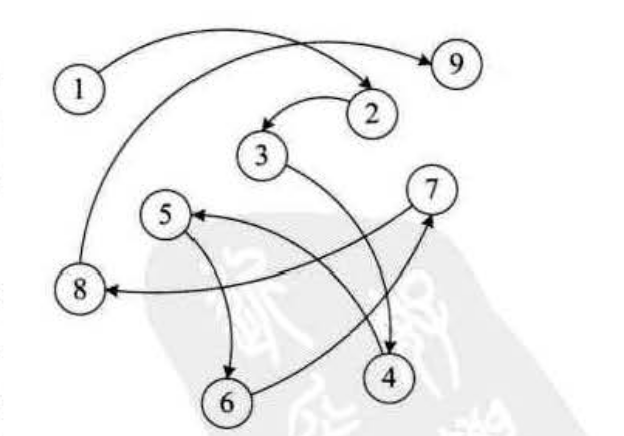
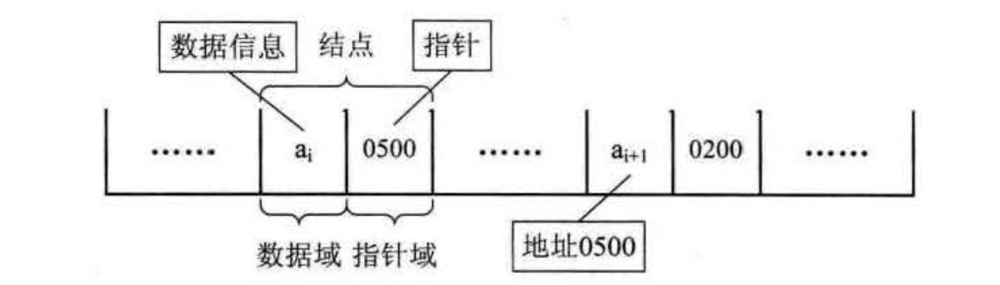
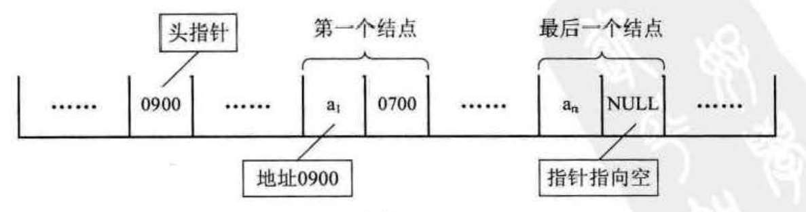

线性表的链式存储结构
===============================================================
### 顺序存储结构不足的解决办法
前面我们讲的 **线性表的顺序存储结构**。它是有缺点的，**最大的缺点就是插入和删除时需要移动大量元素，这显然就需要耗费时间**。
那怎么办？我们考虑 **链式存储结构**。

### 线性表链式存储结构定义
线性表的链式存储结构的特点是用一组任意的存储单元存储线性表的数据元素，这组存储单元可以是连续的，也可以是不连续的。
这就意味着，这些数据元素可以存在内存未被占用的任意位置。图示：

以前在顺序结构中，每个数据元素只需要存数据元素信息就可以了。现在链式结构中，除了要存数据元素信息外，
还要存储它的后继元素的存储地址。

我们把存储数据元素信息的域称为 **数据域**，把存储直接后继位置的域称为 **指针域**。指针域中存储的信息称做指针或链。
这两部分信息组成数据元素的存储映像，称为 **结点(Node)**。

n个结点（ai的存储映像）链结成一个链表，即为线性表（a1,a2,...,an）的链式存储结构，**因为此链表的每个结点中只包含一个指针域**，
所以叫做 **单链表**。单链表正是通过每个结点的指针域将线性表的数据元素按其逻辑次序链接在一起，如图：

对于线性表来说，总得有个头有个尾，链袭也不例外。我们把链表中第一个结点的存储位置叫做头指针，
那么整个链袤的存取就必须是从头指针开始进行了。之后的每一个结点，其实就是上一个的后继指针指向的位置。
想象一下，最后一个结点，它的指针指向哪里？最后一个，当然就意味着直接后继不存在了，所以我们规定，
线性链表的最后一个结点指针为“空”。

### 4线性表链式存储结构代码描述
略了！
