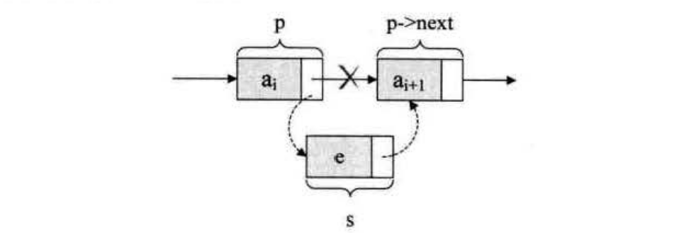
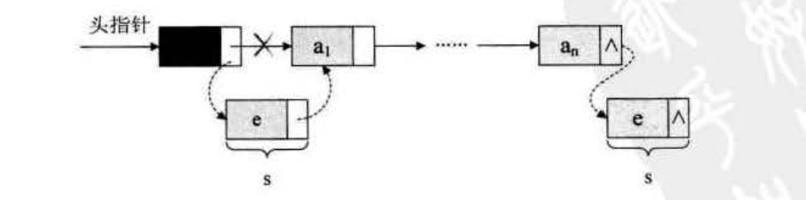
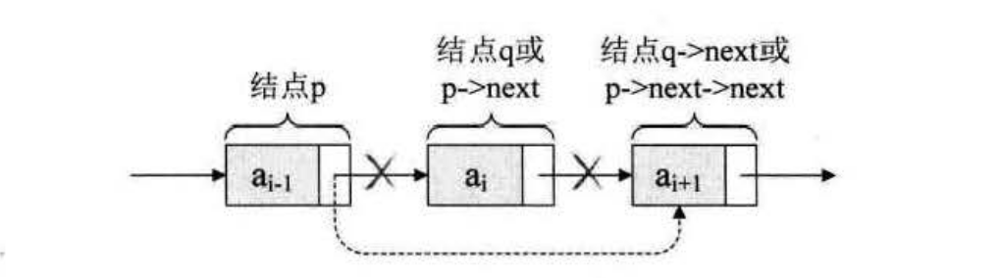

单链表的插入与删除
=============================================================
### 单链表的插入
先来看单链表的插入。假设存储元素`e`的结点为`S`，要实现结点`p`、`p->next`和`S`之间逻辑关系的变化，
只需将结点`S`插入到结点`p`和`p->next`之间即可。可如何插入呢？


根本用不着惊动其他结点，只需要让`s->next`和`p->next`的指针做一点改变即可。
```c
s -> next = p -> next;
p -> next = s;
```



对于单链表的表头和表尾的特殊情况，操作是相同的，如图：



### 单链表的删除
现在我们再来看单链袤的删除。设存储元素`ai`的结点为`q`，要实现将结点`q`删除单链表的操作，
**其实就是将它的前继结点的指针绕过它，指向它的后继结点即可**。如图：



我们所要做的，实际上就是一步，`p->next=p->next->next`，用`q`来取代`p->next`，即是：
```c
q = p -> next;
p -> next = q -> next ;
```
解读这两句代码，也就是说让`p`的后继的后继结点改成`p`的后继结点。

分析一下刚才我们讲解的单链表插入和删除算法，我们发现，它们其实都是由两部分组成；第一部分就是遍历查找第`i`个元素；
第二部分就是插入和删除元素。

从整个算法来说，我们很容易推导出：**它们的时间复杂度都是`O(n)`**。**如果在我们不知道第`i`个元素的指针位置，
单链表数据结构在插入和删除操作上，与线性表的顺序存储结构是没有太大优势的**。但如果，我们希望从第`i`个位置，
插入10个元素，对于顺序存储结构意味着，每一次插入都需要移动`n-i`个元素，每次都是`O(n)`。而单链表，
我们只需要在第一次时，找到第`i`个位置的指针，此时为`O(n)`，接下来只是简单地通过赋值移动指针而已，
时间复杂度都是`0(1)`。显然，**对于插入或删除数据越频繁的操作，单链表的效率优势就越是明显**。
