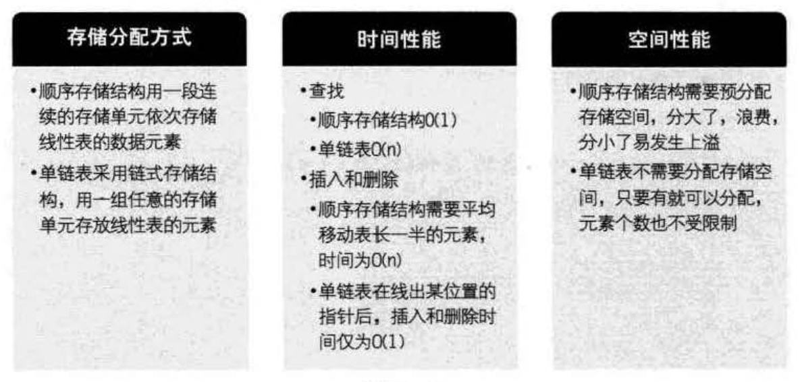

单链表结构与顺序存储结构优缺点
===================================================================
简单地对单链裴结构和顺序存储结构做对比：

通过上面的对比，我们可以得出一些经验性的结论：
+ 若线性表需要频繁查找，很少进行插入和删除操作时，宜采用顺序存储结构。若需要频繁插入和删除时，宜采用单链表结构。
+ 当线性表中的元素个数变化较大或者根本不知道有多大时，最好用单链表结构，这样可以不需要考虑存储空间的大小问题。
而如果事先知道线性表的大致长度，这种用顺序存储结构效率会高很多。
