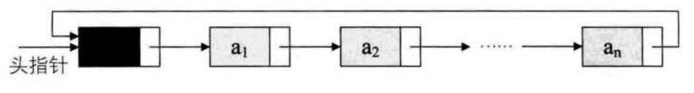
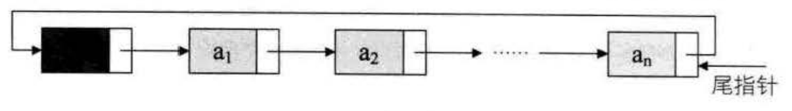
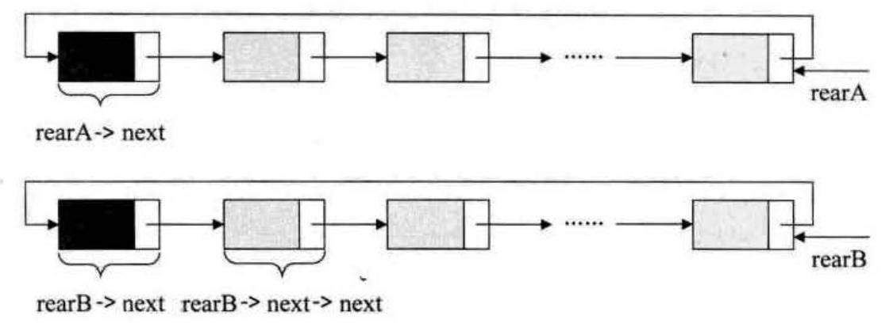
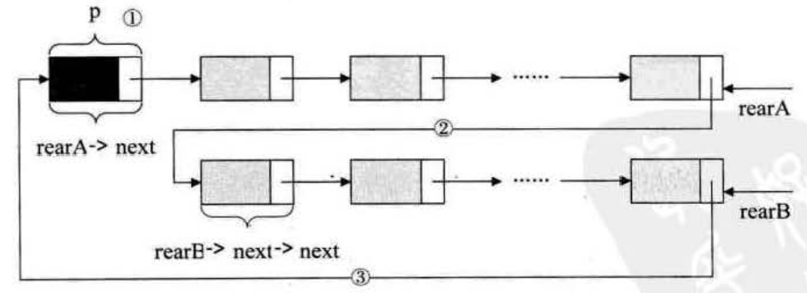

循环链表
===============================================================
对于单链表，由于每个结点只存储了向后的指针，到了尾标志就停止了向后链的操作。将单链表中，终端结点的指针端由
空指针改为指向头结点，就使整个单链表形成一个环，这种 **头尾相接的单链表称为单循环链表，简称循环链表**。

**循环链表解决了一个很麻烦的问题：如何从当中一个结点出发，访问到链表的全部结点**。

为了使空链表与非空链表处理一致，我们通常设一个头结点，当然，这并不是说，循环链表一定要头结点，这需要注意。

循环链表带有头结点的空链表，如图：


对于非空的循环链表，如图：



其实循环链表和单链表的主要差异就在于循环的判断条件上，原来是判断`p->next`是否为空，现在则是`p->next`
不等于头结点，则循环未结束。

在单链表中，我们有了头结点时，我们可以用`0(1)`的时间访问第一个结点，但对于要访问到最后一个结点，
却需要`O(n)`时间，因为我们需要将单链表全部扫描一遍。**有没有可能用`0(1)`的时间由链表指针访问到最后一个结点呢**？
当然可以。

不过我们需要改造一下这个循环链表，**不用头指针，而是用指向终端结点的尾指针** 来表示循环链表：



从上图中可以看到，终端结点用尾指针`rear`指示,则查找终端结点是`0(1)`，而开始结点，其实就是`rear->next->next`，
其时间复杂也为`0(1)`。

举个程序的例子，要将两个循环链表合并成一个表时，有了尾指针就非常简单了。比如下面的这两个循环链表，
它们的尾指针分别是`rearA`和`rearB`：



要想把它们合井，只需要如下的操作即可：



```c
p = rearA->next;                          //保存A表的头结点
rearA->next = rearB->next->next;          //将本是指向B表的第一个结点（不是头结点），赋值给rearA->next
rearB->next = p;                          //将原A表的头结点赋值给rearB->next
free(p);                                  //释放p
```
