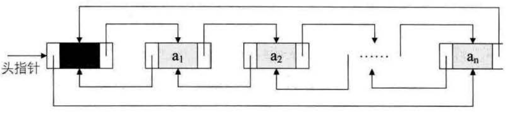

双向链表
==================================================================
我们的单链表，总是从头到尾找结点，难道就不可以正反遍历都可以吗？当然可以，只不过需要加点东西而已。

我们在单链表中，有了`next`指针，这就使得我们要查找下一结点的时同复杂度为`0(1)`。可是如果我们要查找的是
上一结点的话，那最坏的时间复杂度就是`O(n)`了，因为我们每次都要从头开始遍历查找。

**为了克服单向性这一缺点，设计出了双向链表。双向链表是在单链表的每个结点中，再设置一个指向其前驱结点的指针域。
所以在双向链表中的结点都有两个指针域，一个指向直接后继，另一个指向直接前驱**。
```c
//线性表的双向链表存储结构
typedef struct DulNode
{
    ElemType data;
    struct DuLNode ＊prior;                  //直接前驱指针
    struct DuLNode ＊next;                   //直接后继指针
} DulNode,  *DuLinkList;
```
**既然单链表可以有循环链表，那么双向链表当然也可以是循环链表**。

双向链表的循环带头结点的空链表，如图：


非空的循环的带头结点的双向链表，如图：



双向链表的插入节点、删除节点与单链表差不太多，只是多了个前驱的操作，这里不多说！！！
