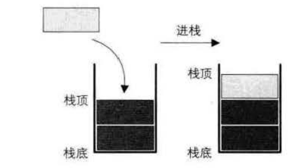
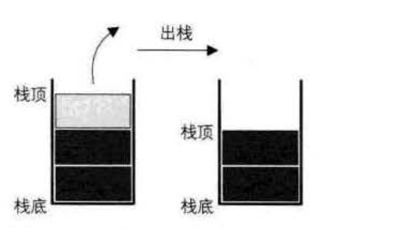

栈的定义
=============================================================

### 栈的定义
**栈（stack）是限定仅在表尾进行插入和删除操作的线性表**。

我们把允许插入和删除的一端称为栈顶（top），另一端称为栈底（bottom），不含任何数据元素的栈称为空栈。
栈又称为后进先出（Last In First Out）的线性表，简称`LlFO`结构。

首先它是一个线性表，也就是说，栈元素具有线性关系，即前驱后继关系。只不过它是一种特殊的线性表而已。
定义中说是在线性表的表尾进行插入和删除操作，这里表尾是指栈顶，而不是栈底。

**它的特殊之处就在于限制了这个线性表的插入和删除位置**，它始终只在栈顶进行。这也就使得：**栈底是固定的，
最先进栈的只能在栈底**。

**栈的插入操作，叫作进栈，也称压栈、入栈**。

**栈的删除操作，叫作出栈，也有的叫作弹栈**。

入栈图：

出栈图：

