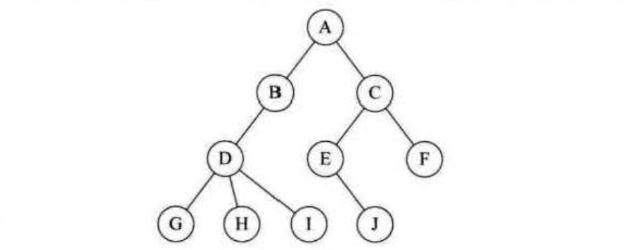
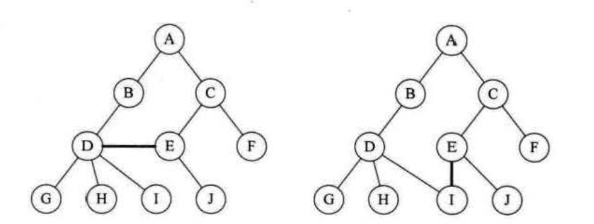
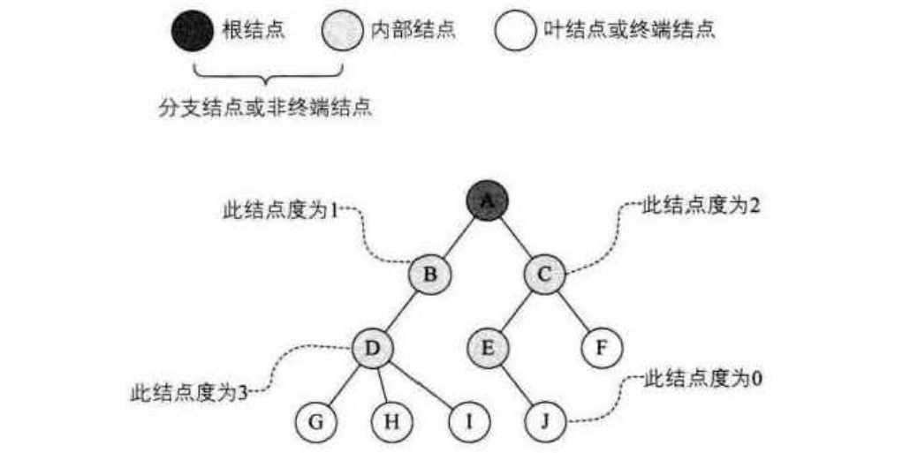
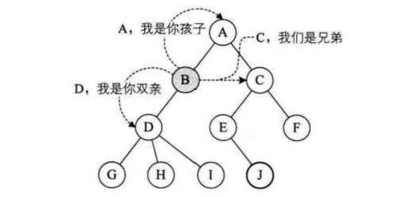
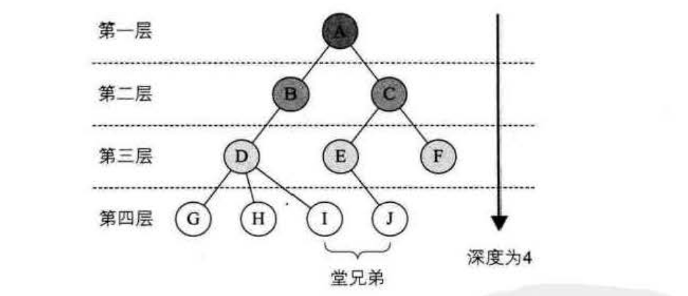

树的定义
=============================================================
树(`Tree`)是`n(n>=O)`个结点的有限集。`n=O`时称为空树。在任意一棵非空树中:
1. 有且仅有一个特定的称为根(`Root`)的结点；
2. 当`n>1`时，其余结点可分为`m(m>O)`个互不交的有限集`T1、T2、......Tm`，其中每一个集合本身又是一棵树，
并且称为根的子树(`SubTree`)。

如圈下图所示：

对于树的定义还需要强调两点：

1. `n>0`时根结点是唯一的，不可能存在多个根结点，别和现实中的大树混在一起，现实中的树有很多根须，
那是真实的树，数据结构中的树是只能有一个根结点。
2. `m>O`时，子树的个数没有限制，但它们一定是互不相交的。像 **下图中的两个结构就不符合树的定义，因为它们都有相交的子树**。

### 结点分类
**树的结点包含一个数据元素及若干指向其子树的分支。结点拥有的子树数称为结点的度(`Degree`)。
度为`0`的结点称为叶结点(`Leaf`)或终端结点；度不为`0`的结点称为非终端结点或分支结点。除根结点之外，分支结点也称为内部结点。
树的度是树内各结点的度的最大值**。如下图所示，因为这棵树结点的度的最大值是结点`D`的度，为`3`，所以树的度也为`3`。

### 结点间关系
**结点的子树的根称为该结点的孩子(`Child`)，相应地，该结点称为孩子的双亲
(`Parent`)**。恩，为什么不是父或母，叫双亲呢？呵呵，对于结点来说其父母同体，唯一的一个，所以只能把它称为双亲了。
**同一个双亲的孩子之间互称兄弟(`Sibling`)。结点的祖先是从根到该结点所经分支上的所有结点**。下图中，所以对于`H`来说,
`D`、`B`、`A`都是它的祖先。反之以某结点为根的子树中的任一结点都称为该结点的子孙。`B`的子孙有`D`、`G`、`H`、`I`。

### 树的其他相关概念
**结点的层次(`Level`)从根开始定义起，根为第一层，根的孩子为第二层。若某结点在第`I`层，则其子树的根就在第`I+1`层。
其双亲在同一层的结点互为堂兄弟**。显然下图中的`D`、`E`、`F`是堂兄弟，而`G`、`H`、`I`、`J` 也是。
**树中结点的最大层次称为树的深度(`Depth`)或高度**，当前树的深度为4。

**如果将树中结点的各子树看成从左至右是有次序的，不能互换的，则称该树为有序树，否则称为无序树**。
森林(`Forest`)是m(m>=O)棵互不相交的树的集合。**对树中每个结点而言，其子树的集合即为森林**。
对于本文第一个图中的树而言，第二个图中的两棵子树其实就可以理解为森林。
