树的存储结构
============================================================
前面章节讲过的 **顺序存储** 和 **链式存储** 两种结构。先来看看顺序存储结构，用一段地址连续的存储单元依次存储线性表的数据元素。
这对于线性表来说是很自然的，对于树这样一对多的结构呢？树中某个结点的孩子可以有多个，这就意味着，
无论按何种顺序将树中所有结点存储到数组中，结点的存储位置都无法直接反映逻辑关系，你想想看，数据元素挨个的存储，
谁是谁的双亲，谁是谁的孩子呢？简单的顺序存储结构是不能满足树的实现要求的。不过 **充分利用顺序存储和链式存储结构的特点，
完全可以实现对树的存储结构的表示**。我们这里要介绍三种不同的表示法: **双亲表示法**、**孩子表示法**、**孩子兄弟表示法**。

### 双亲表示法
除了根结点外，其余每个结点，它不一定有孩子，但是一定有且仅有一个双亲。

我们假设以一组连续空间存储树的结点，同时在每个结点中，附设一个指示器指示其双亲结点的位置。也就是说，
每个结点除了知道自己是谁以外，还知道它的双亲在哪里。图示：


其中`data`是数据域，存储结点的数据信息。而`parent`是指针域，存储该结点的双亲在数组中的下标。
以下是我们的双亲表示法的结点结构定义代码：
```c
//树的双亲表示法结点结构定义
# define MAX_TREE_SIZE 100
typedef int TElemType;    //树结点的数据类型，目前暂定为整型
typedef struct PTNode     //结点结构
{
    TElemType data;       //结点数据
    int parent;           //双亲位置
} PTNode;
typedef struct            //树结构
{
    PTNode nodes[MAX_TREE_SIZE];          //结点数组
    int r,n;                              //根的位置和结点数
} PTree;
```
有了这样的结构定义，我们就可以来实现双亲表示法了。由于根结点是没有双亲的，所以我们约定根结点的位置域设置为`-1`，
这也就意味着，我们所有的结点都存有它双亲的位置。如下图中的树结构和表中的树双亲表示所示。

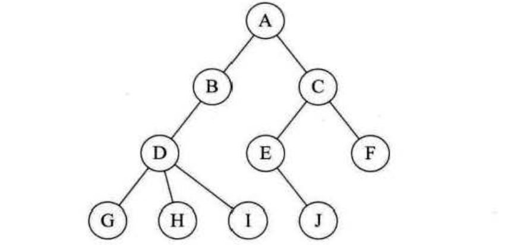

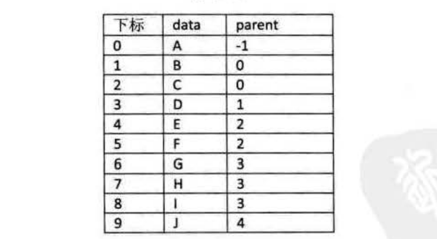

这样的存储结构，我们可以根据结点的`parent`指针很容易找到它的双亲结点，所用的时间复杂度为`O(1)`，
直到`parent`为`-1`时，表示找到了树结点的根。可如果我们要知道结点的孩子是什么，对不起，请遍历整个结构才行。

这真是麻烦，能不能改进一下呢？

当然可以。我们 **增加一个结点最左边孩子的域**，不妨叫它 **长子域**，这样就可以很容易得到结点的孩子。
如果没有孩子的结点，这个长子域就设置为`-1`，如下表所示：

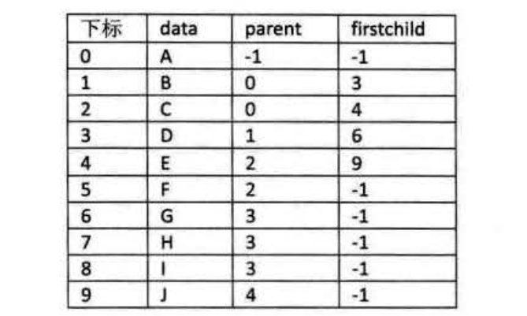

**注：A根节点的`firstchild`写成了`-1`，可能是错了，应该是`1`**。

对于有`0`个或`1`个孩子结点来说，这样的结构是解决了要找结点孩子的问题了。甚至是有`2`个孩子，
知道了长子是谁，另一个当然就是次子了。

另外一个问题场景，我们很 **关注各兄弟之间的关系**，双亲表示法无法体现这样的关系，那我们怎么办？嗯，
可以增加一个 **右兄弟域** 来体现兄弟关系，也就是说，每一个结点如果它存在右兄弟，则记录下右兄弟的下标。
同样的，如果右兄弟不存在，则赋值为`-1`，如下表所示。

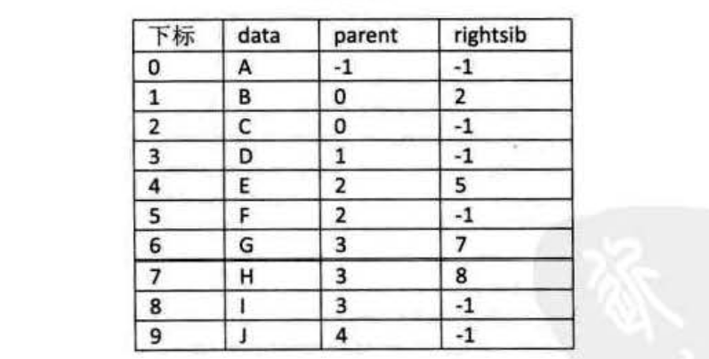

但如果结点的孩子很多，超过了`2`个。我们又关注结点的双亲、又关注结点的孩子、还关注结点的兄弟，而且对时间遍历要求还比较高，
那么我们还 **可以把此结构扩展为有双亲域、长子域、再有右兄弟域**。存储结构的设计是一个非常灵活的过程。
一个存储结构设计得是否合理，取决于基于该存储结构的运算是否适合、是否方便，时间复杂度好不好等。注意也不是越多越好，
有需要时再设计相应的结构。

### 孩子表示法
换一种完全不同的考虑方法。**由于树中每个结点可能有多棵子树，可以考虑用多重链表，即每个结点有多个指针域，
其中每个指针指向一棵子树的根结点，我们把这种方法叫做多重链表表示法**。不过，树的每个结点的度，
也就是它的孩子个数是不同的。所以可以设计两种方案来解决。

#### 方案一
一种是指针域的个数就等于树的度，结构如下表：


其中`data`是数据域。`child1`到`childd`是指针域，用来指向该结点的孩子结点。

对于本文第二个图上的树来说，树的度是`3`，所以我们的指针域的个数是`3`。这种方法实现如下图所示。

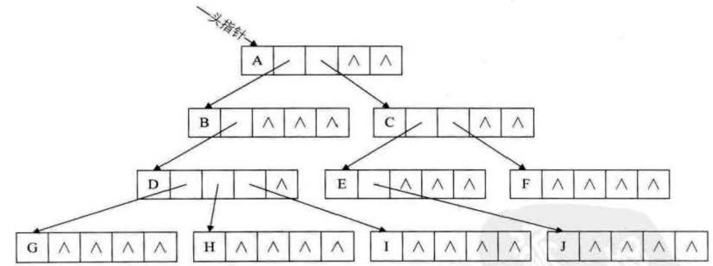

**这种方法对于树中各结点的度相差很大时，显然是很浪费空间的，因为有很多的结点，它的指针域都是空的。
不过如果树的各结点度相差很小时，那就意味着开辟的空间被充分利用了，这时存储结构的缺点反而变成了优点**。

既然很多指针域都可能为空，为什么不按需分配空间呢。于是我们有了第二种方案。

#### 方案二
第二种方案每个结点指针域的个数等于该结点的度，我们专门取一个位置来存储结点指针域的个数，其结构如下表所示。

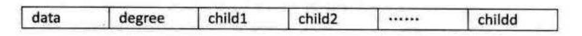

其中`data`为数据域，**`degree`为度域**，也就是存储该结点的孩子结点的个数，`chìld1`到`childd`为指针域，
指向该结点的各个孩子的结点。如图：

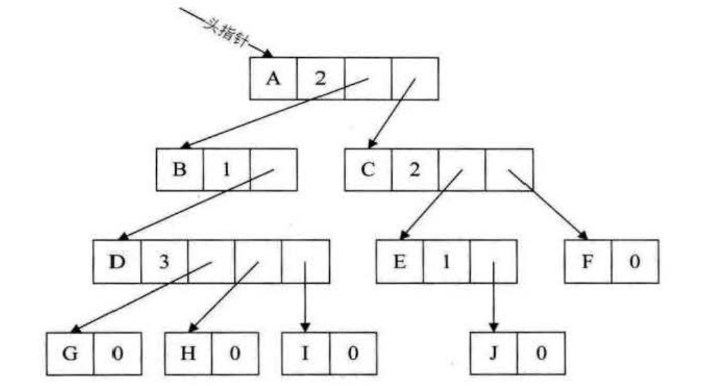

这种方法克服了浪费空间的缺点，对空间利用率是很高了，**但是由于各个结点的链表是不相同的结构，加上要维护结点的度的数值，
在运算上就会带来时间上的损耗**。

能否有更好的方法，既可以减少空指针的浪费又能使结点结构相同。

仔细观察，我们为了要遍历整棵树，把每个结点放到一个顺序存储结构的数组中是合理的，但每个结点的孩子有多少是不确定的，
所以我们再对每个结点的孩子建立一个单链表体现它们的关系。

这就是我们要讲的孩子表示法。具体办法是，**把每个结点的孩子结点排列起来，以单链表作存储结构，则`n`个结点有`n`个孩子链表，
如果是叶子结点则此单链表为空。然后`n`个头指针又组成一个线性表，采用顺序存储结构，存放进一个一维数组
中**。如图下图所示：

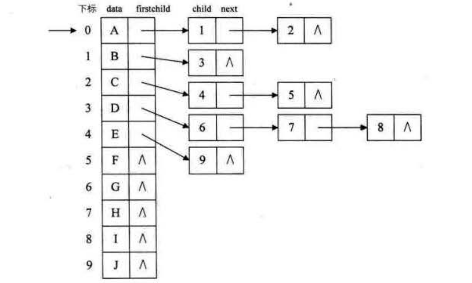

为此，设计两种结点结构，一个是孩子链表的孩子结点：


其中`child`是数据域，用来存储某个结点在表头数组中的下标。`next`是指针域，用来存储指向某结点的下一个孩子结点的指针。

另一个是表头数组的表头结点，如下表所示：


其中`data`是数据域，存储某结点的数据信息。`firstchild`是头指针域，存储该结点的孩子链表的头指针。

以下是我们的孩子表示法的结构定义代码：
```c
//树的孩子表示法结构定义
# define MAX_TREE_SIZE 100
typedef struct CTNode                 //孩子结点
{
    int clild;
    struct CTNode ＊next;
} ＊ChildPtr;
typedef struct                        //表头结构
{
    TElemType data;
    ChildPtr firstchild;
} CTBox;
typedef struct                        //树结构
{
    CTBox nodes[MAX_TREE_SIZE];       //结点数据
    int r,n;                          //根的位置和结点数
} CTree;
```
这样的结构对于我们要查找某个结点的某个孩子，或者找某个结点的兄弟，只需要查找这个结点的孩子单链表即可。
对于遍历整棵树也是很方便的，对头结点的数组循环即可。

但是，这也存在着问题，**我如何知道某个结点的双亲是谁呢？比较麻烦，需要整棵树遍历才行**，
难道就不可以把双亲表示法和孩子表示法综合一下吗？当然是可以。如下图。

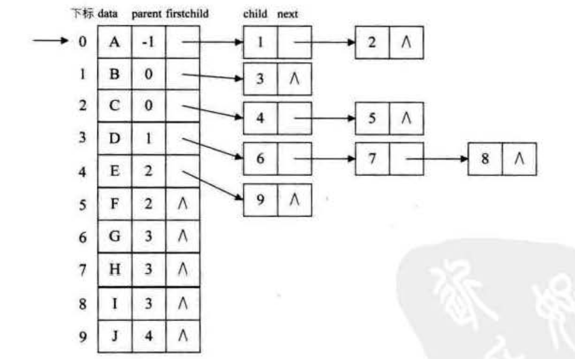

我们把这种方法称为 **双亲孩子表示法**，应该算是孩子表示法的改进。

### 孩子兄弟表示法
如果我们从树结点的兄弟的角度又会如何呢? 当然，对于树这样的层级结构来说，只研究结点的兄弟是不行的，
我们观察后发现，**任意一棵树，它的结点的第一个孩子如果存在就是唯一的，它的右兄弟如果存在也是唯一的**。
因此，我们设置两个指针，分别指向该结点的第一个孩子和此结点的右兄弟。

结点结构如下表：


**其中`data`是数据域，`firstchild`为指针域，存储该结点的第一个孩子结点的存储地址，`rightsib`是指针域，
存储该结点的右兄弟结点的存储地址**。

结构定义代码如下：
```c
//树的孩子兄弟表示法结构定义
typedef struct CSNode
{
    TElemType data;
    struct CSNode ＊firstchild, ＊rightsib;
} CSNode, ＊CSTree;
```
这种方法实现的示意图如下：

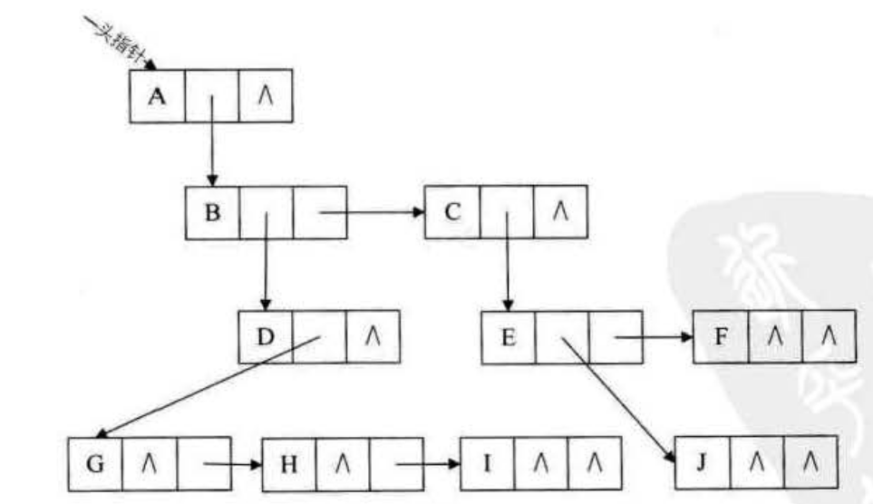

**这种表示法，给查找某个结点的某个孩子带来了方便，只需要通过`firstchild`找到此结点的长子，
然后再通过长子结点的`rightsib`找到它的二弟，接着一直下去，直到找到具体的孩子**。当然，如果想找某个结点的双亲，
这个表示法也是有缺陷的，那怎么办呢？

呵呵，对，如果真的有必要，完全可以再增加一个`parent`指针域来解决快速查找双亲的问题，这里就不再细谈了。

其实这个表示法的最大好处是 **它把一棵复杂的树变成了一棵二叉树**。我们把上图变变形就成了下图这个样子。

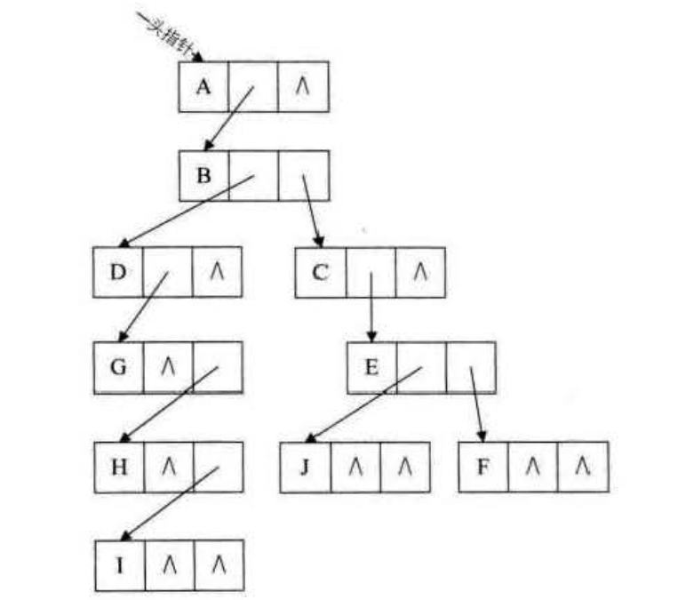

这样就可以充分利用 **二叉树** 的特性和算法来处理这棵树了。嗯？有人间，二叉树是什么？哈哈，别急，
这正是我接下来要重点讲的内容。
