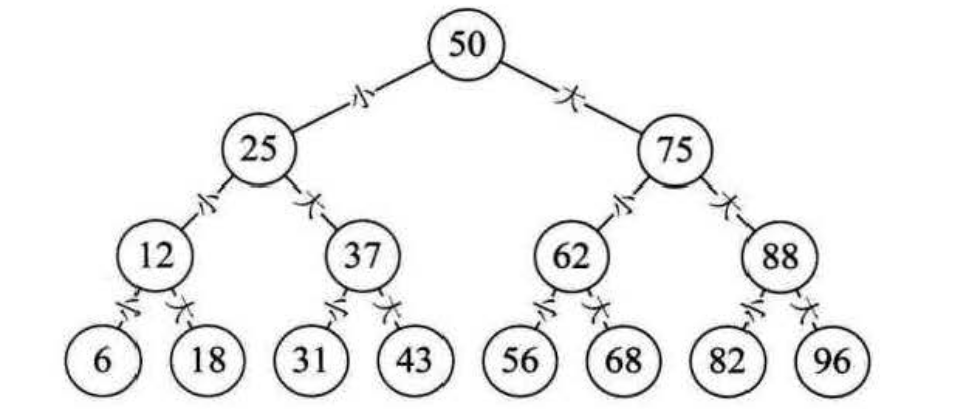
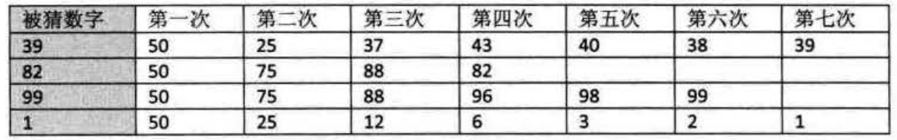

二叉树的定义
===============================================================
现在我们来做个游戏，我在纸上已经写好了一个`100`以内的正整数数字，请大家想办法猜出我写的是哪一个？
注意你们猜的数字不能超过`7`个，我的回答只会告诉你是"大了"或"小了"。

我看到过有些人是一点一点的数字累加的，比如`5`、`10`、`15`、`20`这样猜，这样的猜数策略大低级了，
显然是没有学过数据结构和算法的人才做得出的事。

其实这是一个很经典的 **折半查找算法**。如果我们用下图(下三层省略)的办法，就一定能在`7`次以内，猜出结果来。

由于是`100`以内的正整数，所以我们先猜`50`(`100`的一半)，被告之”大了“，于是再猜`25`(`50`的一半)，
被告之“小了”，于是再猜`37`(`25`与`50`的中间数)，小了，于是猜`43`，大了，`40`，大了，`38`，小了，
`39`，完全正确。过程如下表所示。

我们发现，如果用这种方式进行查找，效率高得不是一点点。对于折半查找的详细讲解，我们后面章节再说。
不过对于这种在某个阶段都是两种结果的情形，比如开和关、0和1、真和假、上和下、对与错，正面与反面等，
都适合用树状结构来建模，而这种树是一种很特殊的树状结构，叫做 **二叉树**。

**二叉树(Binary Tree)是`n`(`n>=O`)个结点的有限集合，该集合或者为空集(称为空二叉树)，
或者由一个根结点和两个互不相交的、分别称为根结点的左子树和右子树的二叉树组成**。
