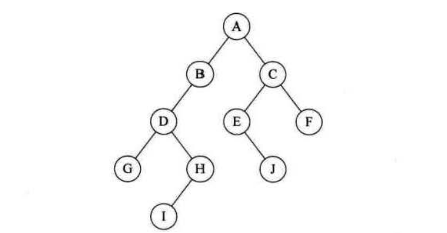
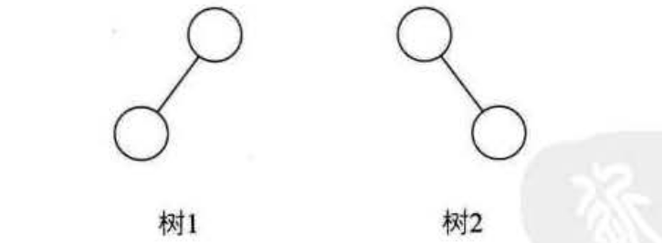
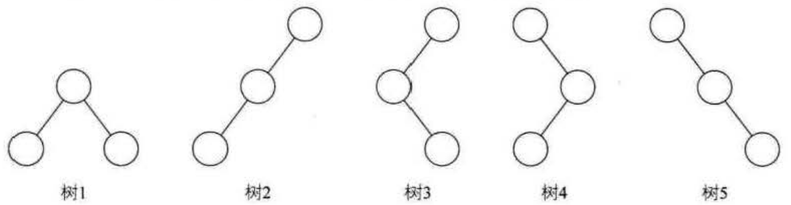
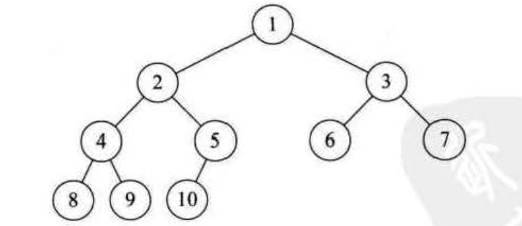
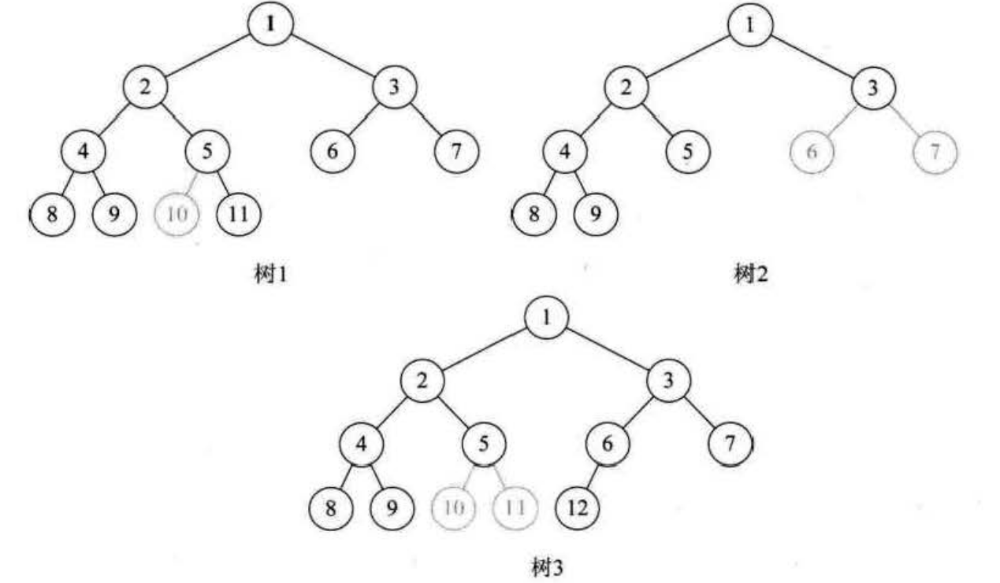

二叉树的定义
===============================================================
现在我们来做个游戏，我在纸上已经写好了一个`100`以内的正整数数字，请大家想办法猜出我写的是哪一个？
注意你们猜的数字不能超过`7`个，我的回答只会告诉你是"大了"或"小了"。

我看到过有些人是一点一点的数字累加的，比如`5`、`10`、`15`、`20`这样猜，这样的猜数策略大低级了，
显然是没有学过数据结构和算法的人才做得出的事。

其实这是一个很经典的 **折半查找算法**。如果我们用下图(下三层省略)的办法，就一定能在`7`次以内，猜出结果来。

由于是`100`以内的正整数，所以我们先猜`50`(`100`的一半)，被告之”大了“，于是再猜`25`(`50`的一半)，
被告之“小了”，于是再猜`37`(`25`与`50`的中间数)，小了，于是猜`43`，大了，`40`，大了，`38`，小了，
`39`，完全正确。过程如下表所示。

我们发现，如果用这种方式进行查找，效率高得不是一点点。对于折半查找的详细讲解，我们后面章节再说。
不过对于这种在某个阶段都是两种结果的情形，比如开和关、0和1、真和假、上和下、对与错，正面与反面等，
都适合用树状结构来建模，而这种树是一种很特殊的树状结构，叫做 **二叉树**。

**二叉树(Binary Tree)是`n`(`n>=O`)个结点的有限集合，该集合或者为空集(称为空二叉树)，
或者由一个根结点和两个互不相交的、分别称为根结点的左子树和右子树的二叉树组成**。

下图就是一棵二叉树：

### 二叉树特点
二叉树的特点有：
+ 每个结点 **最多有两棵子树**，所以二叉树中不存在度大于`2`的结点。注意不是只有两棵子树，而是最多有。
没有子树或者有一棵子树都是可以的。
+ **左子树和右子树是有顺序的**，次序不能任意颠倒。就像人有双手、双脚，但显然左手、左脚和右手、右脚是不一样的，
右手戴左手套、右脚穿左鞋都会极其别扭和难受。
+ **即使树中某结点只有一棵子树，也要区分它是左子树还是右子树**。下图中，树1和树2是同一棵树，但它们却是不同的二叉树。
就好像你一不小心，摔伤了手，伤的是左手还是右手，对你的生活影响度是完全不同的。

  

二叉树具有五种基本形态：

1. 空二叉树。
2. 只有一个根结点。
3. 根结点只有左子树。
4. 根结点只有右子树。
5. 根结点既有左子树又有右子树。

应该说这五种形态还是比较好理解的，那我现在问大家，如果是有三个结点的树，有几种形态？如果是有三个结点的二叉树，
考虑一下，又有几种形态？

若只从形态上考虑，三个结点的树只有两种情况，但对于二叉树采说，由于要区分左右，所以就演变成五种形态，
树1、树2、树3、树4和树5分别代表不同的二叉树。

### 特殊二叉树
我们再来介绍一些特殊的二叉树。这些树可能暂时你不能理解它有什么用处，但先了解一下，以后会提到它们的实际用途。

#### 斜树
顾名思义，斜树一定要是斜的，但是往哪斜还是有讲究。**所有的结点都只有左子树的二叉树叫左斜树。所有结点都是只有右子树的二叉树叫右斜树**。
这两者统称为斜树。上图中的树2就是左斜树，树5就是右斜树。斜树有很明显的特点，就是每一层都只有一个结点，
结点的个数与二叉树的深度相同。

有人会想，这也能叫树呀，与我们的统性表结构不是一样吗？对的，其实线性表结构就可以理解为是树的一种极其特殊的表现形式。

#### 满二叉树
我们通常举的例子也都是左高右低、参差不齐的二叉树。那是否存在完美的二叉树呢？

**在一棵二叉树中，如果所有分支结点都存在左子树和右子树，并且所有叶子都在同一层上，这样的二叉树称为满二叉树**。

下图就是一棵满二叉树，从样子上看就感觉它很完美。

单是每个结点都存在左右子树，不能算是满二叉树，还 **必须要所有的叶子都在同一层上**，这就做到了整棵树的平衡。
因此，满二叉树的特点有：

1. 叶子只能出现在最下一层。出现在其他层就不可能达成平衡。
2. 非叶子结点的度一定是2。否则就是"缺胳膊少腿"了。
3. 在同样深度的二叉树中，满二叉树的结点个数最多，叶子数最多。

#### 完全二叉树
对一棵具有`n`个结点的二叉树按层序编号，如果编号为`i`(`1<=i<=n`)的结点与同样深度的满二叉树中编号为`i`
的结点在二叉树中位置完全相同，则这棵二叉树称为完全二叉树，如下图所示。

首先从字面上要区分，"完全"和"满"的差异，**满二叉树一定是一棵完全二叉树，但完全二叉树不一定是满的**。

**其次，完全二叉树的所有结点与同样深度的满二叉树，它们按层序编号相同的结点，是一一对应的**。
这里有个关键词是 **按层序编号**。下图中的树1，因为5结点没有左子树，却有右子树，那就使得按层编号的第10个编号空档了。
同样道理，下图中的树2，由于3结点没有子树，所以使得6、7编号的位置空挡了。下图中的树3又是因为5编号下没有子树造成
第10和第11位置空档。**只有上图中的树，尽管它不是满二叉树，但是编号是连续的，所以它是完全二叉树**。

从这里我也可以得出一些完全二叉树的特点：

1. 叶子结点只能出现在最下两层。
2. 最下层的叶子一定集中在左部连续位置。
3. 倒数二层，若有叶子结点，一定都在右部连续位置。
4. 如果结点度为1，则该结点只有左孩子，即不存在只有右子树的情况。
5. 同样结点数的二叉树，完全二叉树的深度最小。
