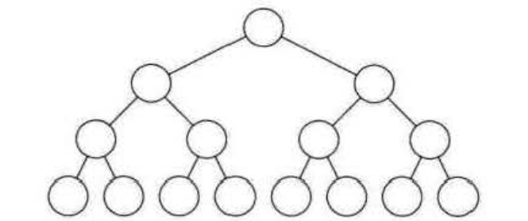
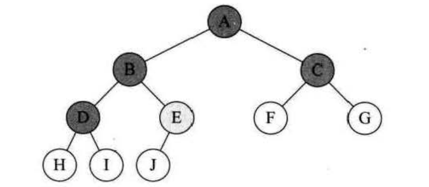
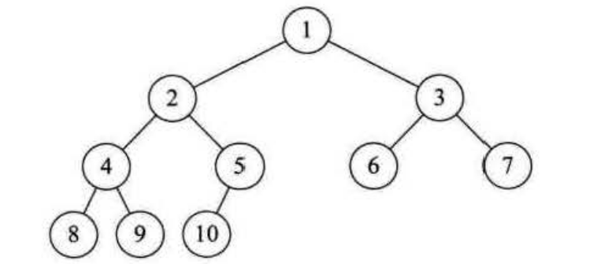

二叉树的性质
==============================================================

### 二叉树性质1
**性质1：在二叉树的第`i`层上至多有2的`i-1`次方个结点(`i>1`)**。

观察图：

+ 第一层是根结点，只有一个，所以2的`1-1`次方，等于2的`0`次方，等于1。
+ 第二层有两个，所以2的`2-1`次方，等于2的`1`次方，等于2。
+ 第三层有四个，所以2的`3-1`次方，等于2的`2`次方，等于4。
+ 第四层有八个，所以2的`4-1`次方，等于2的`3`次方，等于8。

通过数据归纳法的论证，可以很容易得出在二叉树的第`i`层上至多有2的`i-1`次方个结点的结论。

### 二叉树性质2
**性质2：深度为`k`的二叉树至多有2的`k`次方减1个结点(k>=1)**。

深度为`k`意思就是有`k`层的二叉树，我们先来看看简单的。

+ 如果有一层，至多1（2的1次方减1）个结点。
+ 如果有二层，至多1+2=3（2的2次方减1）个结点 。
+ 如果有三层，至多1+2+4=7（2的3次方减1）个结点。
+ 如果有四层，至多1+2+4+8=15（2的4次方减1）个结点。

通过数据归纳法的论证，可以得出，如果有`k`层，此二叉树至多有2的`k-1`个结点。

### 二叉树性质3
**性质3：对任何一棵二叉树`T`，如果其终端结点数为`n0`，度为2的结点数为`n2`，则`n0=n2+1`。
终端结点数其实就是叶子结点数，而一棵二叉树，除了叶子结点外，剩下的就是度为1或2的结点数了，
我们设`n1`为度是1的结点数。则树`T`结点总数`n=n0+n1+n2`**。

下图的例子，结点总数为10，它是由`A`、`B`、`C`、`D`等度为2结点，`F`、`G`、`H`、`I`、`J`等度为0的
叶子结点和`E`这个度为1的结点组成。总和为4+1+5=10。

### 二叉树性质4
**性质4：具有`n`个结点的完全二叉树的深度为`[log2n]+1`（`n`以2为底的对数，其中`[x]`表示不大于`x`的最大整数）**。

由满二叉树的定义我们可以知道，深度为`k`的满二叉树的结点数`n`一定是`2`的`k`次方减`1`。因为这是最多的结点个数。
那么对于`n`等于`2`的`k`次方减`1`，倒推得到满二叉树的度数为`k=log2(n+1)`，比如结点数为15的满二叉树，度为`4`。

完全二叉树我们前面已经提到，它是一棵具有`n`个结点的二叉树，若按层序编号后其编号与同样深度的满二叉树中编号
结点在二叉树中位置完全相同，那它就是完全二叉树。也就是说，它的叶子结点只会出现在最下面的两层。

它的结点数一定少于等于同样度数的满二叉树的结点数`2`的`k`次方减`1`，但一定多于`2`的`k-1`次方减`1`，
由于结点数`n`是整数，`n`小于等于`2`的`k`次方减`1`，意味着`n`小于`2`的`k`次方，`n`大于`k`的`n-1`次方减`1`，
意味着`n`大于等于`2`的`k-1`次方，所以`n`大于等于`2`的`k-1`次方，小于`2`的`k`次方，不等式两边取对数，
得到k减1小于等于`n`以`2`为底的对数，`n`以`2`为底的对数小于`k`，而`k`作为度数也是整数，因此 **`k=[Log2n]+1`**。

### 二叉树性质5
**性质5：如果对一棵有`n`个结点的完全二叉树（其深度为`[log2n]+1`）的结点按层序编号（从第1层到第`[log2n]+1`层，
每层从左到右），对任一结点`i`(`1<=i<=n`)有：

1. 如果`i=1`，则结点`i`是二叉树的根，无双亲；如果`i>1`，则其双亲是结点[i/2]（注：其中`[x]`表示不大于`x`的最大整数）。
2. 如果`2i>n`，则结点`i`无左孩子（结点`i`为叶子结点）;否则其左孩子是结点`2i`。
3. 如果`2i+1>n`，则结点`i`无右孩子；否则其右孩子是结点`2i+1`**。

我们以下图为例，来理解这个性质。这是一个完全二叉树，度为4，结点总数是10。

对于第一条来说是很显然的，`i=1`时就是根结点。`i>1`时，比如结点`7`，它的双亲就是`[7/2]=3`，结点`9`，
它的双亲就`[9/2]=4`。

第二条，比如结点`6`，因为`2X6=12`超过了结点总数`10`，所以结点`6`无左孩子，它是叶子结点。同样，而结点`5`，
因为`2XS=10`正好是结点，总数`10`，所以它的左孩子是结点`10`。

第三条，比如结点`5`，因为`2X5+1=11`，大于结点总数`10`。所以它无右孩子。而结点`3`，因为`2X3+1=7 `小于`10`，
所以它的右孩子是结点`7`。
