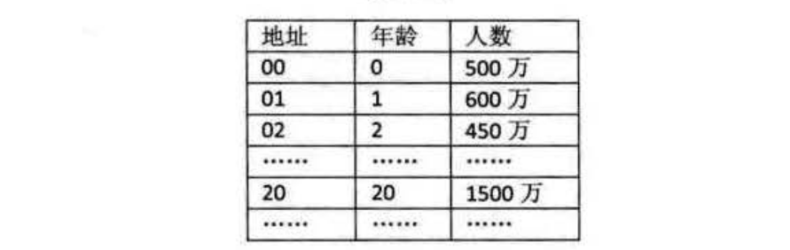
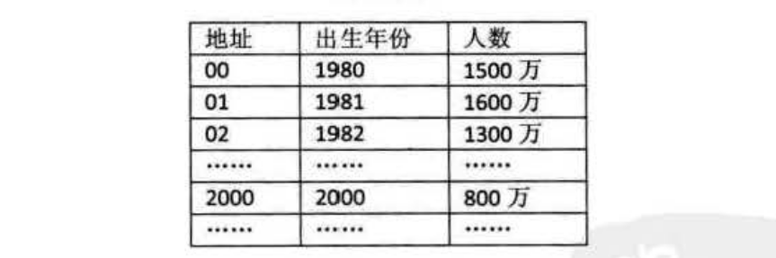

散列函数的构造方法
================================================================
什么才算是好的散列函数呢？这里我们有两个原则可以参考。

+ **计算简单**：你说设计一个算法可以保证所有的关键字都不会产生冲突，但是这个算法需要很复杂的计算，
会耗费很多时间，这对于需要频繁地查找来说，就会大大降低查找的效率了。因此散列函数的计算时间不应该超过其他
查找技术与关键字比较的时间。
+ **触到地址分布均匀**：我们刚才也提到冲突带来的问题，最好的办法就是尽量让散列地址均匀地分布在存储空间中，
这样可以保证存储空间的有效利用，并减少为处理冲突而耗费的时间。

接下来我们就要介绍几种常用的散列函数构造方法。

### 直接定址法
如果我们现在要对0~100岁的人口数字统计一个表，如图：

那么我们对年龄这个关键字就可以直接用年龄的数字作为地址。此时：`f(key) = key`。

如果我们现在要统计的是80后出生年份的人口数，如图：

那么我们对出生年份这个关键字可以用年份减去1980来作为地址。此时：`f(key) = key-1980`。

也就是说，我们可以取关键字的某个线性函数值为散列地址，即：

**f(key) = a x key + b (a 、 b 为常触}**

这样的散列函数优点就是简单、均匀，也不会产生冲突，但问题是这需要事先知道关键字的分布情况，
适合查找表较小且连续的情况。由于这样的限制，**在现实应用中，此方法虽然简单，但却并不常用**。

### 数字分析法
如果我们的关键字是位数较多的数字，比如我们的11位手机号。若我们现在要存储某家公司员工登记表，如果用手机号作为关键字，
那么极有可能前7位都是相同的。那么我们选择后面的四位成为散列地址就是不错的选择。如果这样的抽取工作还是容易出现冲突问题，
还可以对抽取出来的数字再进行反转（如1234改成4321）、右环位移（如1234改成4123）、左环位移、甚至前两数与后两数
叠加（如1234改成12+34=46）等方法。**总的目的就是为了提供一个散列函数，能够合理地将关键字分配到散列袤的各位置**。

这里我们提到了一个关键词————**抽取**。抽取方法是 **使用关键字的一部分来计算散列存储位置** 的方法，
这在散列函数中是常常用到的手段。数字分析法通常适合处理关键字位数比较大的情况，**如果事先知道关键字的分布
且关键字的若干位分布较均匀，就可以考虑用这个方法**。

### 平方取中法
这个方法计算很简单，假设关键字是1234，那么它的平方就是1522756，再抽取中间的3位就是227，用做散列地址。
再比如关键字是4321，那么它的平方就是18671041，抽取中间的3位就可以是671，也可以是710，用做散列地址。
**平方取中法比较适合于不知道关键字的分布，而位数又不是很大的情况**。

### 折叠法
折叠法是将关键字从左到右分割成位数相等的几部分（注意最后一部分位数不够时可以短些），然后将这几部分叠加求和，
并按散列表表长，取后几位作为散列地址。

比如我们的关键字是9876543210，散列表表长为3位，我们将它分为四组，987｜654｜321｜0，然后将它们叠加求和
987+654+321+0=1962，再求后3位得到散列地址为962。

有时可能这还不能够保证分布均匀，不妨从一端向另一端来回折叠后对齐相加。比如我们将987和321反转，再与654和0相加，
变成789+654+123+0=1566，此时散列地址为566。

**折叠法事先不需要知道关键字的分布，适合关键字位数较多的情况**。

### 除留余敢法
**此方法为最常用的构造散列函数方法**。对于散列表长为`m`的散列函数公式为：

**f(key) = key mod p(p <= m)**

`mod`是取模（求余数）的意思。事实上，这方法不仅可以对关键字直接取模，也可在折叠、平方取中后再取模。
很显然，本方法的关键就在于选择合适的`P`，`P`如果选得不好，就可能会容易产生同义词。如下图：

我们对于有12个记录的关键字构造散列表时，就用了`f(key)=key mod 12`的方法。比如`29 mod 12 = 5`，
所以它存储在下标为5的位置。

不过这也是存在冲突的可能的，因为12 = 2 ＊ 6 = 3 ＊ 4。如果关键字中有像18(3 ＊ 6)、30(5 ＊ 6)、
42(7 ＊ 6)等数字，它们的余数都为6，这就和78所对应的下标位置冲突了。
