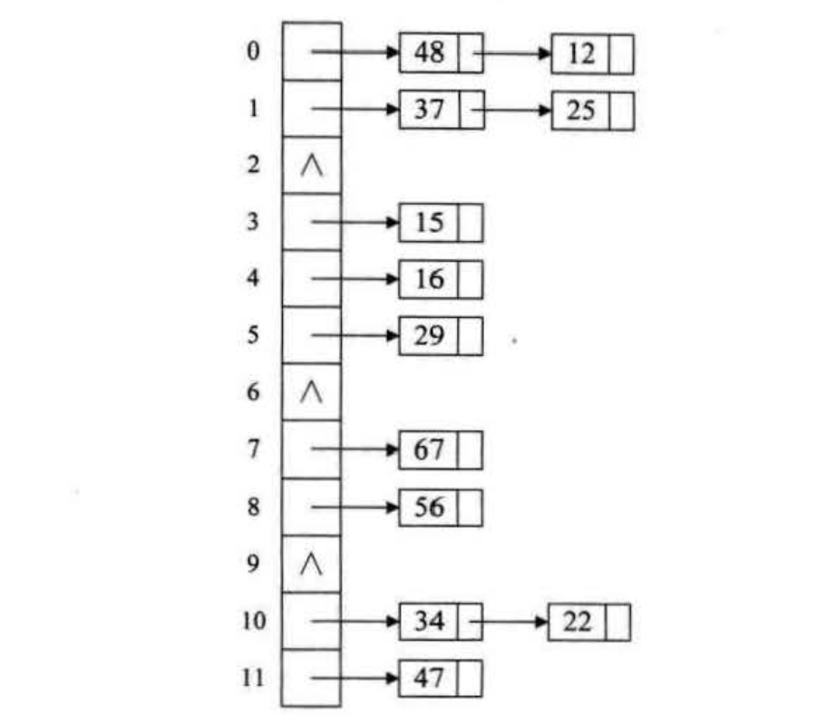
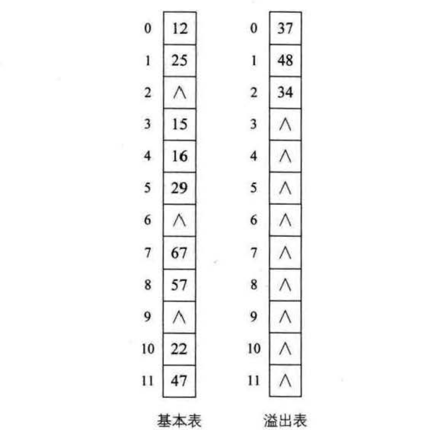

处理散列冲突的方法
==========================================================
当我们在使用散列函数后发现两个关键字`key1!==key2`，但是却有`f(key1)=f(key2)`，即有冲突时，怎么办呢？
我们可以从生活中找寻思路。

试想一下，当你观望很久很久，终于看上一套房打算要买了，正准备下订金，人家告诉你，这房子已经被人买走了，
你怎么办?对呀，再找别的房子呗！这其实就是一种处理冲突的方法———— **开放定址法**。

### 开放定址法
开放定址法就是一旦发生了冲突，就去寻找下一个空的散列地址，只要散列表足够大，空的散列地址总能找到，
并将记录存入。

它的公式是：

**f(key) = (f(key) + di) MOD m  (di = 1,2,3,......m-1)**

比如说，我们的关键字集合为`{12,67,56,16,25,37,22,29,15,47,48,34}`，表长为12。我们用散列函数
`f(key) = key mod 12`。当计算前5个数`{12,67,56,16,25}`时，都是没有冲突的散列地址，直接存入，
如下图：

计算`key=37`时，发现`f(37)=1`，此时就与25所在的位置冲突。于是我们应用上面的公式`f(37)=(f(37)+1) mod 12=2`，
于是将37存入下标为2的位置。这其实就是房子被人买了于是买下一间的作法。如图：

接下来22,29,15,47都没有冲突，正常的存入，如下图：

到了`key=48`，我们计算得到`f(48)=0`，与12所在的0位置冲突了，不要紧，我们`f(48)=(f(48)+1) mod 12=1`，
此时又与25所在的位置冲突。于是`f(48)=(f(48)+2) mod 12=2`，还是冲突.....一直到`f(48)=(f(48)+6) mod12=6`时，
才有空位，机不可失，赶快存入。如图：

**我们把这种解决冲突的开放定址法称为线性探测法**。

从这个例子我们也看到，我们在解决冲突的时候，还会碰到如48和37这种本来都不是同义词却需要争夺一个地址的情况，
我们称这种现象为 **堆积**。很显然，**堆积的出现，使得我们需要不断处理冲突，无论是存入还是查找效率都会大大降低**。

考虑深一步，如果发生这样的情况，当最后一个`key=34`，`f(key)=10`，与22所在的位置冲突，可是22后面没有空位置了，
反而它的前面有一个空位置，尽管可以不断地求余数后得到结果，但效率很差。因此我们可以改进：

这样就等于是可以 **双向寻找** 到可能的空位置。对于34来说，我们取`di=-1`，即可找到空位置了。
另外 **增加平方运算** 的目的是为了 **不让关键字都聚集在某一块区域**。我们称这种方法为 **二次探测法**。

还有一种方法是，在冲突时，对于位移量`d`，采用 **随机函数** 计算得到，我们称之为 **随机探测法**。

此时一定有人问，既然是随机，那么查找的时候不也随机生成`di`吗？如何可以获得相同的地址呢？这是个问题。
这里的随机其实是 **伪随机数**。伪随机数是说，**如果我们设置随机种子相同，则不断调用随机函数可以生成不会重复的数列，
我们在查找时，用同样的随机种子，它每次得到的数列是相同的，相同的`di`当然可以得到相同的散列地址**。

### 再散列函数法
对于我们的散列表来说，我们事先准备多个散列函数。

**fi(key) = RHi(key) (1=1 ,2,...,k)**

这里`RHi`就是不同的散列函数，你可以把我们前面说的什么除留余数、折叠、平方取中全部用上。每当发生散列地址冲突时，
就换一个散列函数计算，相信总会有一个可以把冲突解决掉。这种方法能够使得关键字不产生聚集，当然，相应地也增加了计算的时间。

### 链地址法
为什么有冲突就要换地方呢，我们直接就在原地想办法不可以吗？于是我们就有了 **链地址法**。

将所有关键字为同义词的记录存储在一个单链表中，我们称这种表为同义词子表，在散列表中只存储所有同义词子表的头指针。
对于关键字集合`{12,67,S6,16,25,37,22,29,15,47,48,34}`，我们用前面同样的12为除数，进行除留余数法，可得到如图：

**此时，已经不存在什么冲突换址的问题，无论有多少个冲突，都只是在当前位置给单链表增加结点的问题**。

链地址法对于可能会造成很多冲突的散列函数来说，提供了绝不会出现找不到地址的保障。当然，这也就带来了查找时
需要遍历单链装的性能损耗。

### 公共溢出区法
这个方法其实就更加好理解，你不是冲突吗？好吧，凡是冲突的都跟我走，我给你们这些冲突找个地儿待着。
这就如同孤儿院收留所有无家可归的孩子一样，我们为所有冲突的关键字建立了一个公共的溢出区来存放。就前面的例子而言，
我们共有三个关键字`{37,48,34}`与之前的关键字位置有冲突，那么就将它们存储到 **溢出表** 中，如图：

在查找时，对给定值通过散列函数计算出散列地址后，先与基本表的相应位置进行比对，如果相等，则查找成功。
如果不相等，则到溢出表去进行顺序查找。如果相对于基本表而言，有冲突的数据很少的情况下，公共溢出区的结构对查找性能来说还是非常高的。
