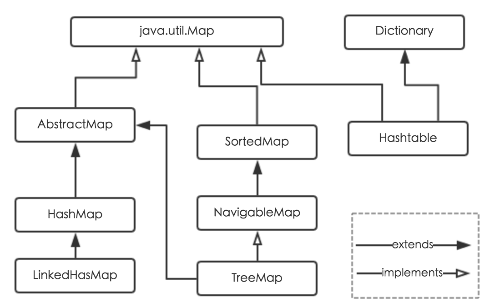

Java8中的HashMap
=================================================================
### 摘要
`HashMap`是Java程序员使用频率最高的用于映射(键值对)处理的数据类型。随着JDK版本的更新，
JDK1.8对`HashMap`底层的实现进行了优化，例如 **引入红黑树的数据结构和扩容的优化等**。
本文结合JDK1.7和JDK1.8的区别，深入探讨`HashMap`的结构实现和功能原理。

### 简介
Java为数据结构中的映射定义了一个接口`java.util.Map`，此接口主要有四个常用的实现类，分别是`HashMap`、
`Hashtable`、`LinkedHashMap`和`TreeMap`，类继承关系如下图所示：



下面针对各个实现类的特点做一些说明：

1. **HashMap**：它根据键的`hashCode`值存储数据，大多数情况下可以直接定位到它的值，因而具有很快的访问速度，
但遍历顺序却是不确定的。**`HashMap`最多只允许一条记录的键为null，允许多条记录的值为null。HashMap非线程安全**，\
即任一时刻可以有多个线程同时写HashMap，可能会导致数据的不一致。如果需要满足线程安全，
可以用`Collections`的`synchronizedMap`方法使`HashMap`具有线程安全的能力，或者使用`ConcurrentHashMap`。
2. **Hashtable**：`Hashtable`是遗留类，很多映射的常用功能与`HashMap`类似，不同的是它承自`Dictionary`类，
并且是 **线程安全** 的，任一时间只有一个线程能写`Hashtable`，**并发性不如`ConcurrentHashMap`**，
因为`ConcurrentHashMap`引入了分段锁。**`Hashtable`不建议在新代码中使用**，不需要线程安全的场合可以用`HashMap`替换，
需要线程安全的场合可以用`ConcurrentHashMap`替换。
3. **LinkedHashMap**：`LinkedHashMap`是`HashMap`的一个子类，**保存了记录的插入顺序**，
在用`Iterator`遍历`LinkedHashMap`时，先得到的记录肯定是先插入的，也可以在构造时带参数，按照访问次序排序。
4. **TreeMap**：`TreeMap`实现`SortedMap`接口，**能够把它保存的记录根据键排序，默认是按键值的升序排序，也可以指定排序的比较器**，
当用`Iterator`遍历`TreeMap`时，得到的记录是排过序的。如果使用排序的映射，建议使用`TreeMap`。在使用`TreeMap`时，
`key`必须实现`Comparable`接口或者在构造`TreeMap`传入自定义的`Comparator`，
否则会在运行时抛出`java.lang.ClassCastException`类型的异常。

对于上述四种`Map`类型的类，要求映射中的`key`是不可变对象。不可变对象是该对象在创建后它的哈希值不会被改变。
如果对象的哈希值发生变化，`Map`对象很可能就定位不到映射的位置了。

通过上面的比较，我们知道了`HashMap`是Java的`Map`家族中一个普通成员，鉴于它可以满足大多数场景的使用条件，
所以是使用频度最高的一个。下文我们主要结合源码，从存储结构、常用方法分析、扩容以及安全性等方面深入讲解`HashMap`的工作原理。

### 内部实现

#### 存储结构（字段）
从结构实现来讲，`HashMap`是 **数组+链表+红黑树**（JDK1.8增加了红黑树部分）实现的，如下如所示。


这里需要讲明白两个问题：数据底层具体存储的是什么？这样的存储方式有什么优点呢？

1. 从源码可知，`HashMap`类中有一个非常重要的字段，就是`Node[] table`，即 **哈希桶数组**，明显它是一个`Node`的数组。
我们来看`Node`[JDK1.8]是何物：
```java
static class Node<K,V> implements Map.Entry<K,V> {
    final int hash;    //用来定位数组索引位置
    final K key;
    V value;
    Node<K,V> next;   //链表的下一个node

    Node(int hash, K key, V value, Node<K,V> next) { ... }
    public final K getKey(){ ... }
    public final V getValue() { ... }
    public final String toString() { ... }
    public final int hashCode() { ... }
    public final V setValue(V newValue) { ... }
    public final boolean equals(Object o) { ... }
}
```
`Node`是`HashMap`的一个内部类，实现了`Map.Entry`接口，本质是就是一个映射(键值对)。上图中的每个黑色圆点就是一个`Node`对象。

2. `HashMap`就是使用 **哈希表** 来存储的。哈希表为解决冲突，可以采用 **开放地址法和链地址法等来解决问题**，
**Java中`HashMap`采用了链地址法**。链地址法，简单来说，就是 **数组加链表** 的结合。在每个数组元素上都一个链表结构，
**当数据被Hash后，得到数组下标，把数据放在对应下标元素的链表上**。例如程序执行下面代码：
```java
map.put("美团","小美");
```
系统将调用"美团"这个`key`的`hashCode()`方法得到其`hashCode`值（该方法适用于每个Java对象），
然后再通过`Hash`算法的后两步运算（高位运算和取模运算，下文有介绍）来定位该键值对的存储位置，
有时两个`key`会定位到相同的位置，表示发生了 **Hash碰撞**。当然`Hash`算法计算结果越分散均匀，
`Hash`碰撞的概率就越小，`map`的存取效率就会越高。

如果哈希桶数组很大，即使较差的`Hash`算法也会比较分散，如果哈希桶数组数组很小，即使好的Hash算法也会出现较多碰撞，
所以就 **需要在空间成本和时间成本之间权衡**，其实就是在根据实际情况确定哈希桶数组的大小，并在此基础上设计好的`hash`算法减少`Hash`碰撞。
那么通过什么方式来控制`map`使得`Hash`碰撞的概率又小，哈希桶数组（Node[] table）占用空间又少呢？
答案就是 **好的Hash算法** 和 **扩容机制**。

在理解`Hash`和扩容流程之前，我们得先了解下`HashMap`的几个字段。从`HashMap`的默认构造函数源码可知，
构造函数就是对下面几个字段进行初始化，源码如下：
```java
int threshold;             // 所能容纳的key-value对极限
final float loadFactor;    // 负载因子
int modCount;  
int size;
```
首先，**`Node[] table`的初始化长度`length`(默认值是`16`)，`LoadFactor`为负载因子(默认值是`0.75`)**，
`threshold`是`HashMap`所能容纳的最大数据量的`Node`(键值对)个数。**`threshold = length ＊ LoadFactor`**。
也就是说，在数组定义好长度之后，负载因子越大，所能容纳的键值对个数越多。

结合负载因子的定义公式可知，**`threshold`就是在此`loadFactor`和`length`(数组长度)对应下允许的最大元素数目，
超过这个数目就重新`resize`(扩容)，扩容后的`HashMap`容量是之前容量的两倍。默认的负载因子0.75是对空间和时间效率的一个平衡选择**，
建议大家不要修改，除非在时间和空间比较特殊的情况下，如果内存空间很多而又对时间效率要求很高，可以降低负载因子`LoadFactor`的值；
相反，如果内存空间紧张而对时间效率要求不高，可以增加负载因子`loadFactor`的值，这个值可以大于1。

`size`这个字段其实很好理解，就是`HashMap`中实际存在的键值对数量。注意和`table`的长度`length`、
容纳最大键值对数量`threshold`的区别。**而`modCount`字段主要用来记录`HashMap`内部结构发生变化的次数，主要用于迭代的快速失败**。
强调一点，内部结构发生变化指的是结构发生变化，例如`put`新键值对，但是某个`key`对应的`value`值被覆盖不属于结构变化。

**在`HashMap`中，哈希桶数组`table`的长度`length`大小必须为`2`的`n`次方(一定是合数)，这是一种非常规的设计，
常规的设计是把桶的大小设计为素数。相对来说素数导致冲突的概率要小于合数**，`Hashtable`初始化桶大小为`11`，
就是桶大小设计为素数的应用（`Hashtable`扩容后不能保证还是素数）。`HashMap`采用这种非常规设计，
**主要是为了在取模和扩容时做优化，同时为了减少冲突**，`HashMap`定位哈希桶索引位置时，也加入了高位参与运算的过程。

这里存在一个问题，即使负载因子和`Hash`算法设计的再合理，也免不了会出现拉链过长的情况，一旦出现拉链过长，
则会严重影响`HashMap`的性能。于是，在JDK1.8版本中，对数据结构做了进一步的优化，引入了 **红黑树**。而 **当链表长度太长（默认超过8）时**，
链表就转换为红黑树，利用红黑树快速增删改查的特点提高`HashMap`的性能，其中会用到红黑树的插入、删除、查找等算法。

### 功能实现（方法）
`HashMap`的内部功能实现很多，本文主要从根据`key`获取 哈希桶数组索引位置、`put`方法的详细执行、扩容过程三个具有代表性的点深入展开讲解。

#### 确定哈希桶数组索引位置
不管增加、删除、查找键值对，定位到哈希桶数组的位置都是很关键的第一步。前面说过`HashMap`的数据结构是数组和链表的结合，
所以我们当然希望这个`HashMap`里面的元素位置尽量分布均匀些，尽量使得每个位置上的元素数量只有一个，那么当我们用`hash`算法求得这个位置的时候，
马上就可以知道对应位置的元素就是我们要的，不用遍历链表，大大优化了查询的效率。`HashMap`定位数组索引位置，
直接决定了`hash`方法的离散性能。先看看源码的实现(方法一 + 方法二):
```java
//方法一
static final int hash(Object key) {   //jdk1.8 & jdk1.7
     int h;
     // h = key.hashCode() 为第一步 取hashCode值
     // h ^ (h >>> 16)  为第二步 高位参与运算
     return (key == null) ? 0 : (h = key.hashCode()) ^ (h >>> 16);
}
//方法二
static int indexFor(int h, int length) {  //jdk1.7的源码，jdk1.8没有这个方法，但是实现原理一样的
     return h & (length-1);  //第三步 取模运算
}
```
这里的`Hash`算法本质上就是三步：**取key的hashCode值、高位运算、取模运算**。

对于任意给定的对象，只要它的`hashCode()`返回值相同，那么程序调用方法一所计算得到的`Hash`码值总是相同的。
我们首先想到的就是把`hash`值对数组长度取模运算，这样一来，元素的分布相对来说是比较均匀的。但是，**模运算的消耗还是比较大的**，
在`HashMap`中是这样做的：**调用方法二，来计算该对象应该保存在table数组的哪个索引处**。

这个方法非常巧妙，它通过`h & (table.length -1)`来得到该对象的保存位，而`HashMap`底层数组的长度总是2的`n`次方，
这是`HashMap`在速度上的优化。**当`length`总是`2`的`n`次方时，`h & (length-1)`运算等价于对`length`取模，
也就是`h%length`，但是`&`比`%`具有更高的效率**。

在JDK1.8的实现中，优化了高位运算的算法，通过`hashCode()`的 **高16位异或低16位** 实现的：`(h = k.hashCode()) ^ (h >>> 16)`，
主要是从速度、功效、质量来考虑的，**这么做可以在数组`table`的`length`比较小的时候，也能保证考虑到高低`Bit`都参与到`Hash`的计算中，
同时不会有太大的开销**。

下面举例说明下，`n`为`table`的长度：


#### 分析HashMap的put方法
`HashMap`的`put`方法执行过程可以通过下图来理解：


1. 判断键值对数组`table`是否为空或为`null`，否则执行`resize()`进行扩容；

2. 根据键值`key`计算`hash`值得到插入的数组索引`i`，如果`table[i]==null`，直接新建节点添加，转向第6步，
如果`table[i]`不为空，转向第3步；

3. 判断`table[i]`的首个元素是否和`key`一样，如果相同直接覆盖`value`，否则转向第四步，
这里的相同指的是`hashCode`以及`equals`；

4. 判断`table[i]`是否为`treeNode`，即`table[i]`是否是红黑树，如果是红黑树，则直接在树中插入键值对，
否则转向第五步；

5. 遍历`table[i]`，判断链表长度是否大于`8`，大于`8`的话把链表转换为`红黑树`，在红黑树中执行插入操作，
否则进行链表的插入操作；遍历过程中若发现`key`已经存在直接覆盖`value`即可；

6. 插入成功后，判断实际存在的键值对数量`size`是否超多了最大容量`threshold`，如果超过，进行扩容。
