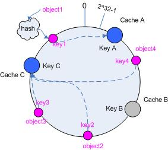
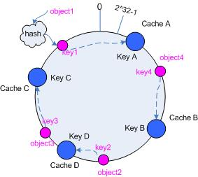
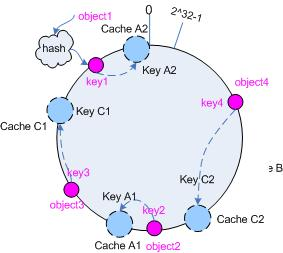

一致性Hash算法
================================================================
一致性hash算法（consistent hashing）早在1997年，就在论文「Consistent hashing and random trees」中被提出，
**目前在cache系统中应用越来越广泛**；

### 基本场景
比如你有`N`个`cache`服务器（后面简称`cache`），那么如何将一个对象`object`映射到`N`个`cache`上呢，
你很可能会采用类似下面的通用方法计算`object`的`hash`值，然后均匀的映射到到`N`个`cache`；

**hash ( object ) % N**

一切都运行正常，再考虑如下的两种情况：

1. 一个`cache`服务器`m`宕掉了（在实际应用中必须要考虑这种情况），这样所有映射到`cache`为`m`的对象都会失效，
怎么办，需要把`cache``m`从`cache`中移除，这时候`cache`是`N-1`台，映射公式变成了：`hash(object)%(N-1)`；
2. 由于访问加重，需要添加`cache`，这时候`cache`是`N+1`台，映射公式变成了：`hash(object)%(N+1)`；

`1`和`2`意味着什么？这意味着突然之间几乎所有的`cache`都失效了。对于服务器而言，这是一场灾难，洪水般的访问都会直接冲向后台服务器；
再来考虑第三个问题，由于硬件能力越来越强，你可能想让后面添加的节点多做点活，显然上面的`hash`算法也做不到。
有什么方法可以改变这个状况呢，这就是 **一致性Hash算法（consistent hashing）**。

### hash算法和单调性
Hash算法有一个衡量指标是单调性（ Monotonicity ），定义如下：

单调性是指：如果已经有一些内容通过哈希分派到了相应的缓冲中，又有新的缓冲加入到系统中。哈希的结果应能够保证
原有已分配的内容可以被映射到新的缓冲中去，而不会被映射到旧的缓冲集合中的其他缓冲区。

可以看到，上面的简单hash算法`hash(object) % N`难以满足单调性要求。

### 一致性Hash（consistent hashing）算法的原理
`consistent hashing`是一种hash算法，简单的说，**在移除/添加一个`cache`时，它能够尽可能小的改变已存在`key`映射关系，
尽可能的满足单调性的要求**。

下面就来按照5个步骤简单讲讲`consistent hashing`算法的基本原理。

#### 环形hash空间
考虑通常的hash算法都是将`value`映射到一个`32`位的`key`值，也即是`0~2^32-1`的数值空间；
我们可以将这个空间想象成 **一个首（ 0 ）尾（ 2^32-1 ）相接的圆环**，如下面图所示的那样：


#### 把对象映射到hash空间
接下来考虑4个对象object1到object4，通过`hash`函数计算出的`hash`值`key`在环上的分布如下图所示：
```java
hash(object1) = key1;
hash(object2) = key2;
hash(object3) = key3;
hash(object4) = key4;
```


#### 把cache映射到hash空间
`Consistent hashing`的基本思想就是 **将对象和`cache`都映射到同一个`hash`数值空间中，并且使用相同的`hash`算法**。

假设当前有`A`,`B`和`C`共`3`台`cache`，那么其映射结果将如下图所示，他们在`hash`空间中，以对应的`hash`值排列。
```java
hash(cache A) = keyA;
hash(cache B) = keyB;
hash(cache C) = keyC;
```


说到这里，顺便提一下`cache`的`hash`计算，**一般的方法可以使用`cache`机器的`IP`地址或者机器名** 作为`hash`输入。

#### 把对象映射到cache
现在`cache`和对象都已经通过同一个`hash`算法映射到`hash`数值空间中了，接下来要考虑的就是如何将对象映射到`cache`上面了。

**在这个环形空间中，如果沿着顺时针方向从对象的`key`值出发，直到遇见一个`cache`，那么就将该对象存储在这个`cache`上**，
因为对象和`cache`的`hash`值是固定的，因此这个`cache`必然是唯一和确定的。这样不就找到了对象和`cache`的映射方法了吗？！

依然继续上面的例子（参见上图），那么根据上面的方法，对象`object1`将被存储到`cacheA`上；`object2`和`object3`对应到`cacheC`；
`object4`对应到`cacheB`；

#### 考察cache的变动
前面讲过，通过`hash`然后求余的方法带来的最大问题就在于不能满足单调性，当`cache`有所变动时，`cache`会失效，
进而对后台服务器造成巨大的冲击，现在就来分析分析`consistent hashing`算法。

##### 移除cache
考虑假设`cacheB`挂掉了，根据上面讲到的映射方法，这时受影响的将仅是那些沿`cacheB`逆时针遍历直到下一个`cache`（cacheC）之间的对象，
也即是本来映射到`cacheA` 上的那些对象。

因此这里仅需要变动对象`object4`，将其重新映射到`cacheC`上即可，见下图：



##### 添加cache
再考虑添加一台新的`cacheD`的情况，假设在这个环形`hash`空间中，`cacheD`被映射在对象`object2`和`object3`之间。
这时受影响的将仅是那些沿`cacheD`逆时针遍历直到下一个`cache`（cacheB）之间的对象（它们是也本来映射到`cacheC`上对象的一部分），
将这些对象重新映射到`cacheD`上即可。

因此这里仅需要变动对象`object2`，将其重新映射到`cacheD`上，参见下图：



### 虚拟节点
考量Hash算法的另一个指标是 **平衡性(Balance)**，定义如下：

平衡性：平衡性是指哈希的结果能够尽可能分布到所有的缓冲中去，这样可以使得所有的缓冲空间都得到利用。

hash算法并不是保证绝对的平衡，如果`cache`较少的话，对象并不能被均匀的映射到`cache`上，比如在上面的例子中，
仅部署`cacheA`和`cacheC`的情况下，在4个对象中，`cacheA`仅存储了`object1`，而`cacheC`则存储了`object2`、
`object3`和`object4`，分布是很不均衡的。

为了解决这种情况，`consistent hashing`引入了“**虚拟节点**”的概念，它可以如下定义：
**“虚拟节点”（virtual node）是实际节点在hash空间的复制品（replica），一实际个节点对应了若干个“虚拟节点”，
这个对应个数也成为“复制个数”，“虚拟节点”在hash空间中以hash值排列**。

仍以仅部署`cacheA`和`cacheC`的情况为例，上面的示例显示，`cache`分布并不均匀。现在我们引入虚拟节点，
并设置“复制个数”为2，这就意味着一共会存在4个“虚拟节点”，`cacheA1`,`cacheA2`代表了`cacheA`，
`cacheC1`,`cacheC2`代表了`cacheC`，假设一种比较理想的情况，参见下图：



此时，对象到“虚拟节点”的映射关系为：

**objec1->cacheA2； objec2->cacheA1； objec3->cacheC1； objec4->cacheC2；**

因此对象`object1`和`object2`都被映射到了`cacheA`上，而`object3`和`object4`映射到了`cacheC`上，
**平衡性有了很大提高**。    

引入“虚拟节点”后，映射关系就从 **{ 对象 -> 节点 }** 转换到了 **{ 对象 -> 虚拟节点 }**。查询物体所在
`cache`时的映射关系如下图所示：


**“虚拟节点”的hash计算可以采用对应节点的IP地址加数字后缀的方式**。例如假设`cacheA`的IP地址为`202.168.14.241`。
引入“虚拟节点”前，计算`cacheA`的`hash`值：
```java
Hash(“202.168.14.241”);
```
引入“虚拟节点”后，计算“虚拟节”点`cacheA1`和`cacheA2`的`hash`值：
```java
Hash(“202.168.14.241#1”);  // cache A1
Hash(“202.168.14.241#2”);  // cache A2
```
