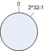

一致性Hash算法
================================================================
一致性hash算法（consistent hashing）早在1997年，就在论文「Consistent hashing and random trees」中被提出，
**目前在cache系统中应用越来越广泛**；

### 基本场景
比如你有`N`个`cache`服务器（后面简称`cache`），那么如何将一个对象`object`映射到`N`个`cache`上呢，
你很可能会采用类似下面的通用方法计算`object`的`hash`值，然后均匀的映射到到`N`个`cache`；

**hash ( object ) % N**

一切都运行正常，再考虑如下的两种情况：

1. 一个`cache`服务器`m`宕掉了（在实际应用中必须要考虑这种情况），这样所有映射到`cache`为`m`的对象都会失效，
怎么办，需要把`cache``m`从`cache`中移除，这时候`cache`是`N-1`台，映射公式变成了：`hash(object)%(N-1)`；
2. 由于访问加重，需要添加`cache`，这时候`cache`是`N+1`台，映射公式变成了：`hash(object)%(N+1)`；

`1`和`2`意味着什么？这意味着突然之间几乎所有的`cache`都失效了。对于服务器而言，这是一场灾难，洪水般的访问都会直接冲向后台服务器；
再来考虑第三个问题，由于硬件能力越来越强，你可能想让后面添加的节点多做点活，显然上面的`hash`算法也做不到。
有什么方法可以改变这个状况呢，这就是 **一致性Hash算法（consistent hashing）**。

### hash算法和单调性
Hash算法有一个衡量指标是单调性（ Monotonicity ），定义如下：

单调性是指：如果已经有一些内容通过哈希分派到了相应的缓冲中，又有新的缓冲加入到系统中。哈希的结果应能够保证
原有已分配的内容可以被映射到新的缓冲中去，而不会被映射到旧的缓冲集合中的其他缓冲区。

可以看到，上面的简单hash算法`hash(object) % N`难以满足单调性要求。

### 一致性Hash（consistent hashing）算法的原理
`consistent hashing`是一种hash算法，简单的说，**在移除/添加一个`cache`时，它能够尽可能小的改变已存在`key`映射关系，
尽可能的满足单调性的要求**。

下面就来按照5个步骤简单讲讲`consistent hashing`算法的基本原理。

#### 环形hash空间
考虑通常的hash算法都是将`value`映射到一个`32`位的`key`值，也即是`0~2^32-1`的数值空间；
我们可以将这个空间想象成 **一个首（ 0 ）尾（ 2^32-1 ）相接的圆环**，如下面图所示的那样：

